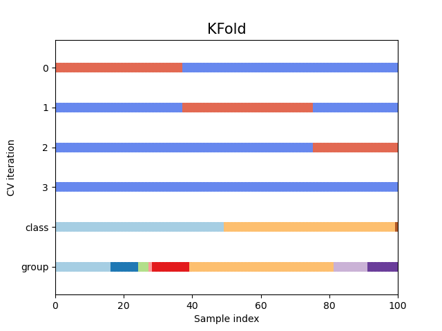
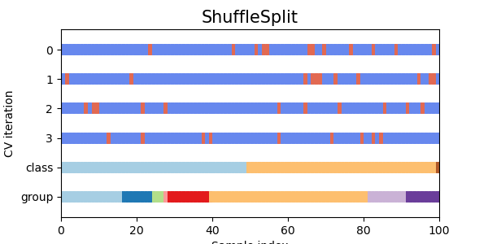
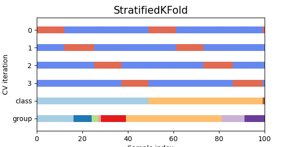
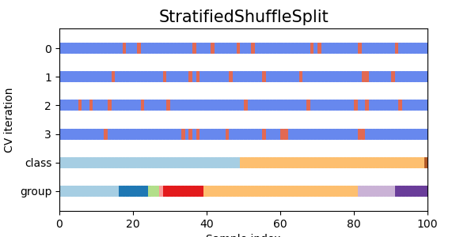
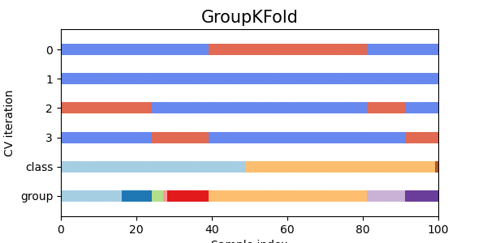
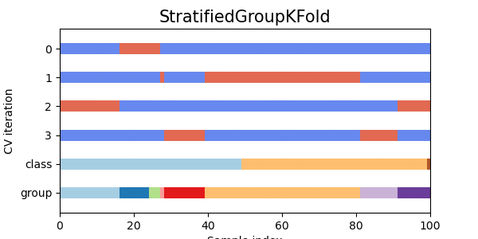
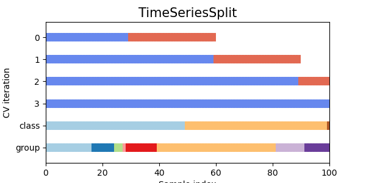

# Model Selection and Evaluation

[Sci-kit Learn web-site](https://scikit-learn.org/stable/model_selection.html)

## Cross-validation: Evaluating estimator performance

Evaluating a prediction function on the same data it was trained on is a methodological mistake. A model that simply memorizes the labels of the training samples would achieve a perfect score but would fail to predict anything useful on new, unseen data.

The simplest and often-used method to train and evaluate a model is to randomly split the data into training and test sets. However, when tuning hyperparameters, there's a risk of overfitting to the test set because parameters might be adjusted until the model performs optimally on this specific set. This results in information about the test set leaking into the model, making the evaluation metrics unreliable for assessing generalization performance. To address this, another portion of the dataset can be reserved as a "validation set." The model is trained on the training set, evaluated on the validation set, and finally tested on the test set once the model appears successful.

However, splitting the data into three sets reduces the number of samples available for training, and the results can vary depending on the specific random partition of the training and validation sets. Cross-validation is a solution to this problem.

Cross-validation is a statistical method used to evaluate the performance of a machine learning model by dividing the data into multiple subsets and assessing the model's performance on different subsets. Its primary goal is to ensure that the model generalizes well to unseen data and to reduce the risk of overfitting. While a test set should still be reserved for final evaluation, the validation set becomes unnecessary when using cross-validation. In the basic approach, known as k-fold cross-validation, the training set is divided into k smaller sets. The model is trained on k-1 of these sets and validated on the remaining set, rotating through all k combinations. This method ensures that each data point is used for both training and validation, providing a more robust evaluation of the model's performance.

The workflow is the following one:

### Keys of applying cross-validation

- **Data efficiency**: By splitting the data into training and test sets, a significant part of the data is reserved for testing and not used for training. This can be problematic if a limited amount of data is available. In cross-validation, especially in k-fold cross-validation, the data is divided into k subsets (folds). The model is trained k times, each time using k-1 of the subsets for training and the remaining subset for validation. This ensures that each sample of the data set is used for both training and validation, providing a more complete estimate of the model's performance.
- **Trustable evaluation**: By splitting the data into training and test sets, the evaluation of the model may depend to a large extent on how the data set is divided. Different divisions may produce different results, making the assessment less reliable and more subject to variability. Cross-validation reduces this variability because each sample in the dataset is used for both training and validation.
- **Reducing over-fitting risk**: If hyperparameters are adjusted using an additional validation set, there is still a risk of overfitting these parameters to the specific samples in the validation set. In cross-validation, the hyperparameter fit is based on multiple partitions of the dataset, which decreases the likelihood of the model overfitting to a specific partition. This ensures that the model generalises better to unseen data.

Cross-validation has the following scheme:

### Different cross validation strategies for Independent and Identically Distributed (i.i.d.)

Independent and  Identically Distributed (i.i.d.) is a term used in probability and statistics to describe a collection of random variables that have the same probability distribution. The i.i.d. property implies two main characteristics:

1. Identical Distribution: Each random variable in the collection follows the same probability distribution. This means they have the same probability density function (pdf) or probability mass function (pmf), the same mean, the same variance, and generally the same moments.
2. Independence: Each random variable is independent of the others. This means that the occurrence of one random variable does not influence the occurrence of any other.

The i.i.d. assumption simplifies the mathematical treatment of random variables in various statistical procedures such as:

- Law of Large Numbers (LLN): Under the i.i.d. assumption, the sample mean converges to the population mean as the sample size increases.
- Central Limit Theorem (CLT): Under the i.i.d. assumption, the distribution of the sample mean approximates a normal distribution as the sample size becomes large, regardless of the original distribution of the data.

In practice, data often does not perfectly meet the i.i.d. assumption, but the assumption can still provide useful approximations and insights in many real-world scenarios.

#### K-Fold

KFold divides all the samples in groups of samples, called folds (if k=n this is equivalent to the Leave One Out strategy), of equal sizes (if possible). The prediction function is learned using k-1 folds, and the fold left out is used for test.

#### Repeated K-Fold

RepeatedKFold repeats K-Fold n times. It can be used when one requires to run KFold n times, producing different splits in each repetition. It works if you want to compute standard deviation in the experiments.

#### Leave One Out (LOO)

LeaveOneOut (or LOO) is a simple cross-validation. Each learning set is created by taking all the samples except one, the test set being the sample left out. Thus, for n samples, we have n different training sets and n different tests set. This cross-validation procedure does not waste much data as only one sample is removed from the training set.

LOO cross-validation, although exhaustive, is more computationally expensive and tends to have high variance. In comparison, k-fold cross validation (with k=5 k=5 or k=10) is more efficient and provides more stable estimates of the generalization error. For these reasons, k-fold is generally the preferred choice for model selection and performance evaluation.

#### Random permutations cross-validation

The ShuffleSplit iterator generates a user-defined number of independent train/test dataset splits. Samples are first shuffled and then split into training and test sets. To ensure reproducibility of the results, the randomness can be controlled by explicitly seeding the random_state pseudo-random number generator.

### Different cross validation strategies with stratification based on class labels

Some classification problems can exhibit a significant imbalance in the distribution of target classes; for example, there may be many more negative samples than positive ones. In such cases, it is recommended to use stratified sampling, as implemented in StratifiedKFold and StratifiedShuffleSplit. This approach ensures that the relative class frequencies are approximately preserved in each training and validation fold, leading to more reliable model evaluation.

#### Stratified k-fold

StratifiedKFold is a variation of k-fold which returns stratified folds: each set contains approximately the same percentage of samples of each target class as the complete set.

#### Stratified Shuffle Split

StratifiedShuffleSplit is a variation of ShuffleSplit, which returns stratified splits, i.e which creates splits by preserving the same percentage for each target class as in the complete set.

### Different cross validation strategies for grouped data

#### Group k-fold

Group K-Fold is a cross-validation technique used when there are groups in the **data that should not be split between the training and testing sets.** This is particularly useful in scenarios where observations within a group are related, and splitting them across folds could lead to data leakage or overestimating the model's performance.

How Group k-fold works:

1. Grouping: The data is divided into groups based on a specified group identifier. Each observation in the dataset belongs to one of these groups.
2. Splitting: The groups are then split into K roughly equal-sized folds. Importantly, the groups are kept intact within each fold. This means that all observations from a given group will be entirely in either the training set or the test set for any given fold.
3. Cross-Validation Process: The cross-validation process is then performed K times, where in each iteration, one fold is used as the test set and the remaining K-1 folds are used as the training set. This ensures that each group is used for testing exactly once.

Example:

Let's say we have a dataset of medical records from different patients, where each patient represents a group. We don't want to split a single patient's records between the training and test sets because observations from the same patient could be highly correlated.

Here's a step-by-step example with three groups and three folds:

Data:

- Group 1: Observations 1, 2, 3
- Group 2: Observations 4, 5, 6
- Group 3: Observations 7, 8, 9

Folds:

- Fold 1:
    - Training: Group 2 (Observations 4, 5, 6), Group 3 (Observations 7, 8, 9)
    - Testing: Group 1 (Observations 1, 2, 3)
- Fold 2:
    - Training: Group 1 (Observations 1, 2, 3), Group 3 (Observations 7, 8, 9)
    - Testing: Group 2 (Observations 4, 5, 6)
- Fold 3:
    - Training: Group 1 (Observations 1, 2, 3), Group 2 (Observations 4, 5, 6)
    - Testing: Group 3 (Observations 7, 8, 9)

#### StratifiedGroupKFold

StratifiedGroupKFold is an advanced cross-validation technique that combines the principles of stratified sampling and group-wise splitting. This method is particularly useful when dealing with datasets that have both groups of **related observations and imbalanced class distributions**. It ensures that each fold has a balanced representation of the target classes while keeping all observations from each group intact within each fold.

Example:

Let's assume we have a dataset with the following structure:

- Groups: Represent patients, each with multiple observations.
- Classes: Represent disease status, which is imbalanced.

Data Structure:

- Group 1: Observations 1 (Class 0), 2 (Class 0), 3 (Class 1)
- Group 2: Observations 4 (Class 1), 5 (Class 0), 6 (Class 1)
- Group 3: Observations 7 (Class 0), 8 (Class 0), 9 (Class 0)

StratifiedGroupKFold Splits:

- Fold 1:

    - Training: Group 2 (Observations 4, 5, 6), Group 3 (Observations 7, 8, 9)
    - Testing: Group 1 (Observations 1, 2, 3)

- Fold 2:

    - Training: Group 1 (Observations 1, 2, 3), Group 3 (Observations 7, 8, 9)
    - Testing: Group 2 (Observations 4, 5, 6)

- Fold 3:

    - Training: Group 1 (Observations 1, 2, 3), Group 2 (Observations 4, 5, 6)
    - Testing: Group 3 (Observations 7, 8, 9)

### Cross validation of time series data

Time series data is characterized by autocorrelation, meaning that observations close in time are correlated. Classical cross-validation techniques, such as KFold and ShuffleSplit, assume that samples are independent and identically distributed (i.i.d.), which leads to unreasonable correlations between training and testing instances when applied to time series data. This results in poor estimates of the generalization error. Therefore, it is crucial to evaluate a model for time series data on "future" observations that are least similar to those used for training. TimeSeriesSplit provides a solution to this problem by creating splits that respect the temporal order of the data.

TimeSeriesSplit is a variation of k-fold which returns first k  folds as train set and the (k+1) th fold as test set. Note that unlike standard cross-validation methods, successive training sets are supersets of those that come before them. Also, it adds all surplus data to the first training partition, which is always used to train the model.

This class can be used to cross-validate time series data samples that are observed at fixed time intervals.

## Tuning hyper-parameters of an estimator

## Tuning the decision of threshold for class prediction

## Metrics and scoring: quantifying the quality of predictions

Well, there are a LOT of metrics for quantifying the quality of predictions, The sklearn.metrics module implements several loss, score, and utility functions but you can also define your custom scoring in case of need.

For more information: [Model Evaluation](https://scikit-learn.org/stable/modules/model_evaluation.html)

### Regression metrics

#### Mean absolute error (MAE)

#### Mean squared error (MSE)

#### Mean absolute percentage error (MAPE)

#### Explained variance score (With R2 scoring)

### Classification metrics

Some metrics are essentially defined for binary classification tasks (e.g. f1_score, roc_auc_score). In these cases, by default only the positive label is evaluated

#### Accuracy score

#### Confusion matrix

#### Balanced accuracy score

#### Precision, recall and F-measures

## Validation curves
