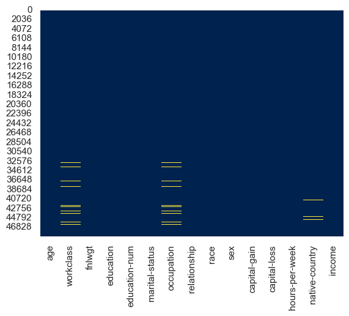
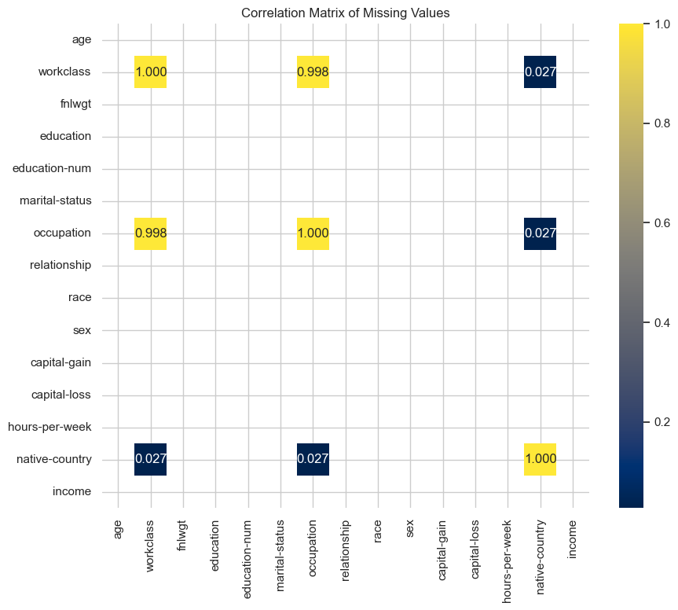
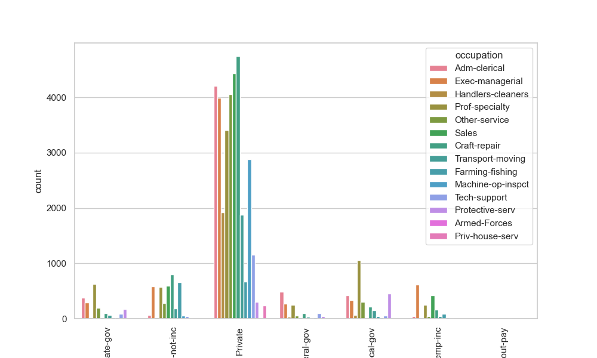

# Census Income

[Dataset Link](https://archive.ics.uci.edu/dataset/2/adult)

Prediction task is to determine whether a person's income is over $50,000 a year.

## Dataset information
- 48842 subjects, 14 multivariate categories: Categorical as string-encoded and Integer. Target is defined as '<=50K' and '>50K'.
Categories are:
age: continuous.
workclass: Private, Self-emp-not-inc, Self-emp-inc, Federal-gov, Local-gov, State-gov, Without-pay, Never-worked.
fnlwgt: continuous.
education: Bachelors, Some-college, 11th, HS-grad, Prof-school, Assoc-acdm, Assoc-voc, 9th, 7th-8th, 12th, Masters, 1st-4th, 10th, Doctorate, 5th-6th, Preschool.
education-num: continuous.
marital-status: Married-civ-spouse, Divorced, Never-married, Separated, Widowed, Married-spouse-absent, Married-AF-spouse.
occupation: Tech-support, Craft-repair, Other-service, Sales, Exec-managerial, Prof-specialty, Handlers-cleaners, Machine-op-inspct, Adm-clerical, Farming-fishing, Transport-moving, Priv-house-serv, Protective-serv, Armed-Forces.
relationship: Wife, Own-child, Husband, Not-in-family, Other-relative, Unmarried.
race: White, Asian-Pac-Islander, Amer-Indian-Eskimo, Other, Black.
sex: Female, Male.
capital-gain: continuous.
capital-loss: continuous.
hours-per-week: continuous.
native-country: United-States, Cambodia, England, Puerto-Rico, Canada, Germany, Outlying-US(Guam-USVI-etc), India, Japan, Greece, South, China, Cuba, Iran, Honduras, Philippines, Italy, Poland, Jamaica, Vietnam, Mexico, Portugal, Ireland, France, Dominican-Republic, Laos, Ecuador, Taiwan, Haiti, Columbia, Hungary, Guatemala, Nicaragua, Scotland, Thailand, Yugoslavia, El-Salvador, Trinadad&Tobago, Peru, Hong, Holand-Netherlands.

- Has missing values! Let's start with this pre-processing step.

## Missing values analysis

The procedure is as follows:

1. **Detecting columns with missing values:** Using EDA (Exploratory Data Analysis) functions to detect what is the quantity of missing values.
2. **Calculate percentage of missing values:** It is useful because we can decide if we would remove rows, columns or impute the number with some technique.
3.  **Analize pattern of missing values:** Are they randomly missing or there is any kind of pattern that we can leverage it? For this point, we are going to use the following strategies:
    -  **Heatmap of missing values:** 
    
    
    In the visualization, we can see that there are some columns with missing values, which are highlighted in a different color (yellow) in contrast to the others. In particular, the columns that appear to have missing values ​​include:

        - *workclass*
        - *occupation*
        - *native-country*

        The rest of the columns do not appear to have missing values. This suggests that the missing data problem is concentrated in a limited number of features, which will allow us to apply specific strategies only on those columns.
    - **Correlation between missing values:** 
    
    From the figure, we can detect some key observations:
        - **Strong correlation between workclass and occupation:** There is a very high correlation between missing values ​​in the workclass and occupation columns (0.9984), indicating that when a value is missing in one, it is also likely to be missing in the other. This suggests that the missing values ​​in both columns might be related, perhaps because the absence of information on workclass also implies that information on occupation is missing.
        - **Slight correlation between workclass, occupation, and native-country:** The workclass and occupation columns also have a slight correlation with the missing values ​​in the native-country column (0.0268), indicating that, although weak, the missing values ​​in native-country could be related to the missing information in the other two columns. 
        - **Without correlation between other columns.**
    - **Missing Pattern Analysis**:

### Is there any logic relation among these features?

We want to find if there is any hidden relation between *workclass* and *ocupation* features to infere the values to column in function of the other one. On the other hand, *native-country* shows a small correlation, so we can handle it as a independent feature.

For this reason, we are going to explore different techniques:
- **Relation between both columns (cross-analysis):** We are going to see how the *workclass* and *occupation* columns are related in the rows where there are no missing values. (During this analysis, I realized that the dataframe contains '?' values, so I needed to change them to NaN).
- **Relation visualization (countplot):** See if there are some plots that allows us to visualize clear patterns. 

- **Conditional probability:** We are going to explore the conditional probability of a column given another column. For example, the probability that a person has a certain value in occupation given that we already know their workclass. This can help us decide how to fill in missing values ​​in one column when the other is present. 

The following table shows the conditional probability of **workclass given occupation**:

| workclass        | Adm-clerical | Armed-Forces | Craft-repair | Exec-managerial | Farming-fishing | Handlers-cleaners | Machine-op-inspct | Other-service | Priv-house-serv | Prof-specialty | Protective-serv | Sales   | Tech-support | Transport-moving |
|------------------|--------------|--------------|--------------|-----------------|-----------------|-------------------|-------------------|---------------|-----------------|----------------|-----------------|---------|--------------|------------------|
| Federal-gov      | 0.086794     | 1.0          | 0.015216     | 0.044035        | 0.006040        | 0.017375          | 0.006287          | 0.011172      | 0.0             | 0.040992       | 0.047813        | 0.003089 | 0.066390     | 0.015711          |
| Local-gov        | 0.075031     | 0.0          | 0.034522     | 0.054387        | 0.028859        | 0.031371          | 0.007942          | 0.060938      | 0.0             | 0.171905       | 0.457782        | 0.002907 | 0.040111     | 0.066242          |
| Private          | 0.749955     | 0.0          | 0.776832     | 0.656425        | 0.449664        | 0.928089          | 0.953673          | 0.824091      | 1.0             | 0.552333       | 0.304171        | 0.806504 | 0.798064     | 0.798301          |
| Self-emp-inc     | 0.008376     | 0.0          | 0.027323     | 0.101380        | 0.055034        | 0.002896          | 0.005625          | 0.008531      | 0.0             | 0.039695       | 0.005086        | 0.076308 | 0.006224     | 0.016136          |
| Self-emp-not-inc | 0.012475     | 0.0          | 0.130563     | 0.096451        | 0.438255        | 0.010135          | 0.019523          | 0.056063      | 0.0             | 0.093163       | 0.007121        | 0.107376 | 0.029046     | 0.077707          |
| State-gov        | 0.066833     | 0.0          | 0.015380     | 0.047157        | 0.016779        | 0.009170          | 0.006287          | 0.038797      | 0.0             | 0.101912       | 0.178026        | 0.003634 | 0.060166     | 0.025478          |
| Without-pay      | 0.000535     | 0.0          | 0.000164     | 0.000164        | 0.005369        | 0.000965          | 0.000662          | 0.000406      | 0.0             | 0.000000       | 0.000000        | 0.000000 | 0.000000     | 0.000000          |

This second table shows shows the conditional probability of **occupation given workclass**:

| workclass        | Adm-clerical | Armed-Forces | Craft-repair | Exec-managerial | Farming-fishing | Handlers-cleaners | Machine-op-inspct | Other-service | Priv-house-serv | Prof-specialty | Protective-serv | Sales   | Tech-support | Transport-moving |
|------------------|--------------|--------------|--------------|-----------------|-----------------|-------------------|-------------------|---------------|-----------------|----------------|-----------------|---------|--------------|------------------|
| Federal-gov      | 0.340084     | 0.010475     | 0.064944     | 0.187151        | 0.006285        | 0.025140          | 0.013268          | 0.038408      | 0.000000        | 0.176676       | 0.032821        | 0.011872 | 0.067039     | 0.025838          |
| Local-gov        | 0.134247     | 0.000000     | 0.067283     | 0.105548        | 0.013712        | 0.020727          | 0.007653          | 0.095663      | 0.000000        | 0.338329       | 0.143495        | 0.005102 | 0.018495     | 0.049745          |
| Private          | 0.124108     | 0.000000     | 0.140034     | 0.117826        | 0.019761        | 0.056716          | 0.085000          | 0.119654      | 0.007137        | 0.100543       | 0.008818        | 0.130921 | 0.034035     | 0.055447          |
| Self-emp-inc     | 0.027729     | 0.000000     | 0.098525     | 0.364012        | 0.048378        | 0.003540          | 0.010029          | 0.024779      | 0.000000        | 0.144543       | 0.002950        | 0.247788 | 0.005310     | 0.022419          |
| Self-emp-not-inc | 0.018125     | 0.000000     | 0.206629     | 0.151994        | 0.169083        | 0.005438          | 0.015277          | 0.071466      | 0.000000        | 0.148887       | 0.001813        | 0.153030 | 0.010875     | 0.047385          |
| State-gov        | 0.189298     | 0.000000     | 0.047451     | 0.144876        | 0.012620        | 0.009591          | 0.009591          | 0.096416      | 0.000000        | 0.317516       | 0.088339        | 0.010096 | 0.043917     | 0.030288          |
| Without-pay      | 0.142857     | 0.000000     | 0.047619     | 0.047619        | 0.380952        | 0.095238          | 0.095238          | 0.095238      | 0.000000        | 0.000000       | 0.000000        | 0.047619 | 0.000000     | 0.047619          |

**We can infere the following results for missing values anaylisis:**
- **Unbalanced distribution:** As seen in the graph, most occupations belong to the *Private* class. This suggests that the *Private* class is dominant, and there is a strong relationship between occupation and job class.
- **Conditional probabilities:** In the *Private* class, occupations such as *Craft-repair*, *Handlers-cleaners*, and *Machine-op-inspct* have a high probability (over 90%) of belonging to that class. Similarly, some occupations are exclusive to certain job classes, such as *Armed-Forces* in *Federal-gov*, or with *Priv-house-serv*, working as a *Private*

### Imputation based on the relationship between columns

#### Steps

1. **Identify missing values:** detect where the missing values ​​are in both columns (*workclass* and *occupation*).

2. **Calculate conditional probabilities:** using our computed conditional probabilities, we infere the most probably values.

3. **Impute the most probable value:** with the most likely associated with the other column. For example, if occupation is *Craft-repair* and *workclass* is missing, and you know that *Craft-repair* is highly associated with *Private*, you impute *Private* on workclass.  

* Tener en cuenta que si una persona nunca trabajó, no puede tener una ocupacion.

 la clase "Never-worked" debería ser tratada de manera especial, ya que una persona que nunca ha trabajado no debería tener una ocupación asociada. Este es el unico caso donde vamos a dejar ocupacion vacia. Y eso es muy importante para tener en cuenta a la hora de entrenar el modelo

!Contar un poco el algoritmo que utilicé acá

## Multivariate features: How to handle them?

Now that we handled our missing values and have a kind of "curated" dataset, we figured out that we have a multivariate dataset. Also, we don't have too much information about our target: Is it balanced? Those doubts we are going to dig in on this section.

As we saw in our "First sense of the dataset", the features are categorical and in string-encoded format. We need to encode these categories when we develop our predictive model. (Cual utilizas? Por que?)

## Continous data distribution
 Estas gráficas te permiten ver si los datos están sesgados, tienen valores atípicos, o si siguen una distribución normal. Nos sirve para realizar la normalización antes de proceder con el análisis de clasificación.

### Age
[Age dist](./plots/dist_age.png)
This feature doesn't look too skewed.

### Final Weight
[FW dist](./plots/dist_fnlwgt.png)
Skewness: The distribution of the fnlwgt column is skewed, meaning it has a long tail on one side. This can often lead to outliers.

### Education num
[EN dist](./plots/dist_education-num.png)
Education num is just a numeric encoding column of the string-encoded format column. To avoid feeding our classifier with this data twice, we must delete either this numbers column or the string-encoded column. I prefer to keep the numbers column. This feature doesn't look too skewed.

### Capital gain
[Cg dist](./plots/dist_capital-gain.png)
Skewness: The distribution of the capital-gain column is skewed, meaning it has a long tail on one side. This can often lead to outliers.

### Capital loss
[Cl dist](./plots/dist_capital-loss.png)
Skewness: The distribution of the capital-gain column is skewed, meaning it has a long tail on one side. This can often lead to outliers.

### Hours per week
[hpw dist](./plots/dist_hours-per-week.png)
Hours per week doesn't look skewed.

### Conclusions
Knowing that the data is very skewed, with some outliers that can influence in our final prediction, we are going to keep that in mind to perform a good transformation to this data. We could either perform a logarithmic transformation or a robust scalation.

## Categorical variables encoding

## Normalization of integer values

## Unbalanced dataset handling (Under and Over sampling)

## Clasification Task
As our friends from [sci-kit learn](https://scikit-learn.org/stable/modules/classification_threshold.html) says:

> Classification is best divided into two parts:
> - The statistical problem of learning a model to predict, ideally, class probabilities.
> - The decision problem to take concrete action based on those probability predictions.
>
> For binary classification in scikit-learn, class labels predictions are obtained by hard-coded cut-off rules: a positive class is predicted when the conditional probability is greater than 0.5 (obtained with predict_proba) or if the decision score is greater than 0 (obtained with decision_function).

