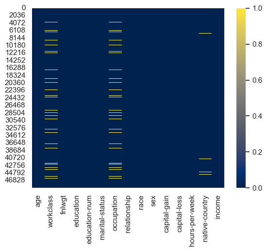
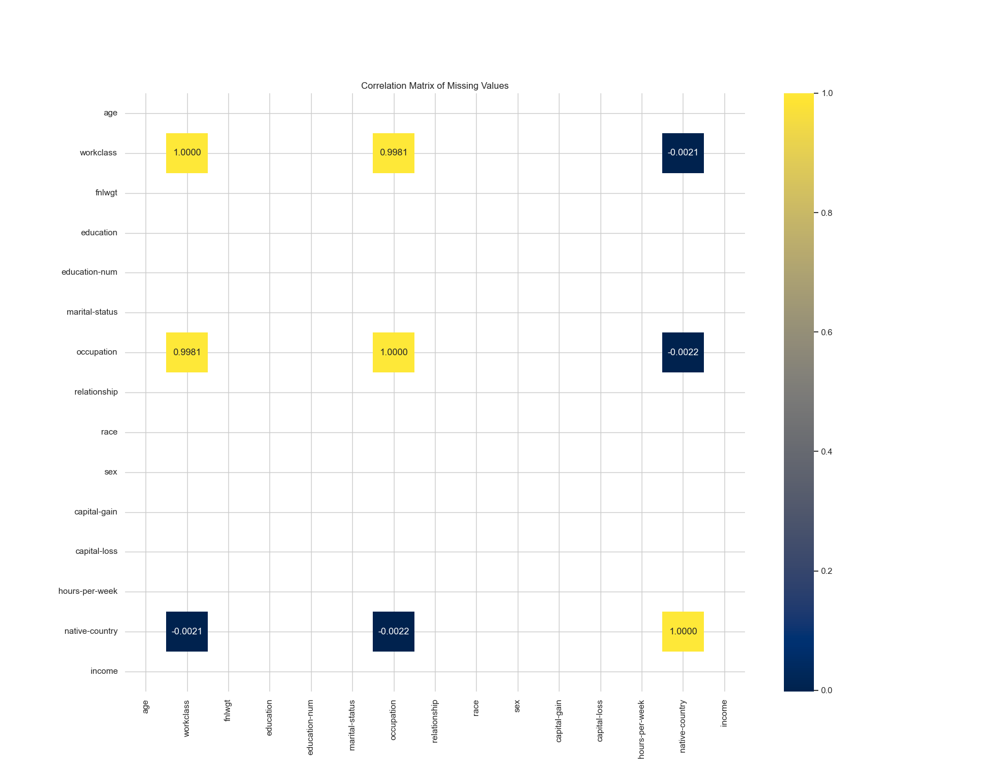
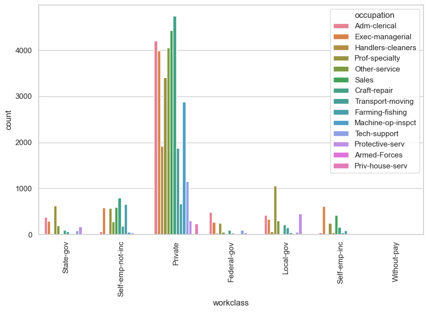
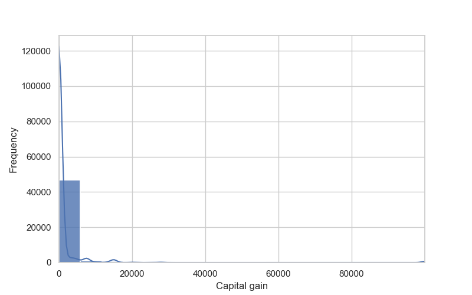
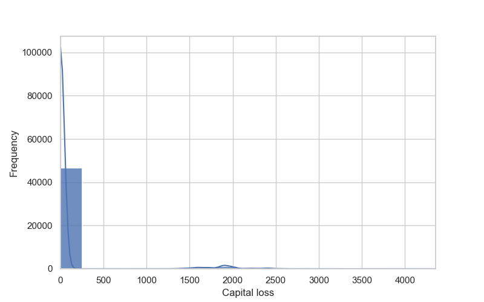
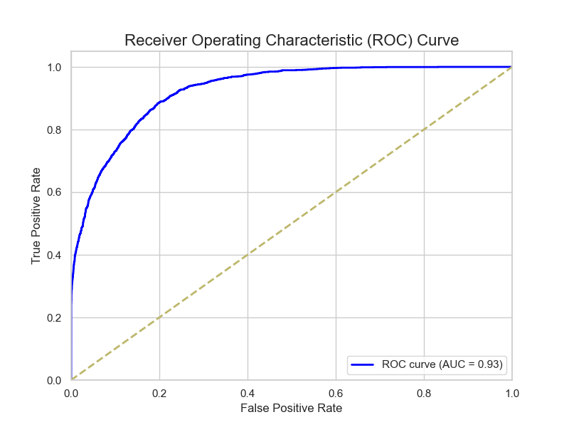

# Census Income

[[“Adult Data Set”, UCI Machine Learning Repository]](https://archive.ics.uci.edu/dataset/2/adult)

Prediction task is to determine whether a person's income is over $50,000 a year.

## Dataset Information

The dataset contains **48,842 subjects** with **14 multivariate categories**. These categories include both **categorical** (string-encoded) and **continuous** (integer) variables. The target variable is classified as `<=50K` or `>50K` (income groups).

### Categories:

- **Age**: Continuous (numerical).
- **Workclass**: Categorical (e.g., Private, Self-emp-not-inc, Self-emp-inc, Federal-gov, Local-gov, State-gov, Without-pay, Never-worked).
- **Final Weight (fnlwgt)**: Continuous (numerical).
- **Education**: Categorical (e.g., Bachelors, Some-college, 11th, HS-grad, Prof-school, Assoc-acdm, Assoc-voc, etc.).
- **Education-Num**: Continuous (numerical representation of education levels).
- **Marital Status**: Categorical (e.g., Married-civ-spouse, Divorced, Never-married, Separated, Widowed, Married-spouse-absent, Married-AF-spouse).
- **Occupation**: Categorical (e.g., Tech-support, Craft-repair, Other-service, Sales, Exec-managerial, Prof-specialty, etc.).
- **Relationship**: Categorical (e.g., Wife, Own-child, Husband, Not-in-family, Other-relative, Unmarried).
- **Race**: Categorical (e.g., White, Asian-Pac-Islander, Amer-Indian-Eskimo, Other, Black).
- **Sex**: Categorical (Female, Male).
- **Capital Gain**: Continuous (numerical).
- **Capital Loss**: Continuous (numerical).
- **Hours per Week**: Continuous (numerical).
- **Native Country**: Categorical (e.g., United-States, Cambodia, England, Puerto-Rico, Canada, Germany, India, Japan, Greece, South, China, Cuba, etc.).

### Notes:
- The dataset contains **missing values**.
- Pre-processing steps such as handling missing data are recommended before analysis.

## Missing Values Analysis

The following procedure was used to analyze and handle missing values in the dataset:

1. **Detecting Missing Values**: 
   - We utilized Exploratory Data Analysis (EDA) techniques to identify which columns contain missing values and to quantify the extent of the missing data.
   
2. **Calculating the Percentage of Missing Values**: 
   - Understanding the proportion of missing data is essential to decide whether to remove rows, drop entire columns, or apply imputation techniques. Columns or rows with significant missing data might be removed, while others with minimal missing data could be filled using appropriate methods.

3. **Analyzing Missing Data Patterns**:
   - The goal was to determine if the missing data was random or followed a specific pattern that could inform our preprocessing steps. We employed the following strategies:

   - **Heatmap of Missing Values**:
     
     
     
     The heatmap visualization highlights columns with missing values in yellow. The columns that appear to have missing data are:
     - `workclass`
     - `occupation`
     - `native-country`

     The remaining columns show no missing values. This indicates that missing data is localized to a few features, allowing us to focus on specific strategies for these columns.

   - **Correlation of Missing Values**:
     
     
     
     Key insights from the correlation matrix:
     - **High correlation between `workclass` and `occupation`**: A strong correlation (0.9984) exists between missing values in these two columns, suggesting that if one is missing, the other is likely missing as well. This may indicate a dependency between the two features.
     - **Weak correlation with `native-country`**: There is a slight correlation between missing values in `workclass` and `occupation` with `native-country` (0.0268), implying a minor relationship between the missing data in these columns.
     - **No correlation among other columns**: No significant correlations were observed between other features.

   - **Missing Pattern Analysis (MPA)**: Given the strong correlation between missing values in `workclass` and `occupation`, we performed an MPA to further explore their relationship.
     1. **Missing `workclass` with present `occupation`**:
        - No instances were found where `workclass` was missing but `occupation` was present. This suggests a direct dependency between the two columns—when `workclass` is missing, `occupation` is likely missing as well.
     2. **Missing `occupation` with present `workclass`**:
        - Instances were found where `occupation` was missing while `workclass` was recorded as `"Never-worked"`. This indicates that individuals categorized as `"Never-worked"` typically have no occupation listed.

The missing values are concentrated in the `workclass`, `occupation`, and `native-country` columns. The high correlation between `workclass` and `occupation` suggests that missing data in these fields can be handled together. For individuals marked as `"Never-worked"`, it is reasonable to assume that they have no occupation, and this could be reflected in the data by filling `occupation` as `"No occupation"` or leaving it as `NaN`.

### Is there any logical relationship among these features?
For this reason, we are going to explore different techniques:
- **Relation between both columns (cross-analysis):** We are going to see how the *workclass* and *occupation* columns are related in the rows where there are no missing values. (During this analysis, I realized that the dataframe contains '?' values, so I needed to change them to NaN).

- **Conditional probability:** We are going to explore the conditional probability of a column given another column. For example, the probability that a person has a certain value in occupation given that we already know their workclass. This can help us decide how to fill in missing values ​​in one column when the other is present. 

The following table shows the conditional probability of **workclass given occupation**:

| workclass        | Adm-clerical | Armed-Forces | Craft-repair | Exec-managerial | Farming-fishing | Handlers-cleaners | Machine-op-inspct | Other-service | Priv-house-serv | Prof-specialty | Protective-serv | Sales   | Tech-support | Transport-moving |
|------------------|--------------|--------------|--------------|-----------------|-----------------|-------------------|-------------------|---------------|-----------------|----------------|-----------------|---------|--------------|------------------|
| Federal-gov      | 0.086794     | 1.0          | 0.015216     | 0.044035        | 0.006040        | 0.017375          | 0.006287          | 0.011172      | 0.0             | 0.040992       | 0.047813        | 0.003089 | 0.066390     | 0.015711          |
| Local-gov        | 0.075031     | 0.0          | 0.034522     | 0.054387        | 0.028859        | 0.031371          | 0.007942          | 0.060938      | 0.0             | 0.171905       | 0.457782        | 0.002907 | 0.040111     | 0.066242          |
| Private          | 0.749955     | 0.0          | 0.776832     | 0.656425        | 0.449664        | 0.928089          | 0.953673          | 0.824091      | 1.0             | 0.552333       | 0.304171        | 0.806504 | 0.798064     | 0.798301          |
| Self-emp-inc     | 0.008376     | 0.0          | 0.027323     | 0.101380        | 0.055034        | 0.002896          | 0.005625          | 0.008531      | 0.0             | 0.039695       | 0.005086        | 0.076308 | 0.006224     | 0.016136          |
| Self-emp-not-inc | 0.012475     | 0.0          | 0.130563     | 0.096451        | 0.438255        | 0.010135          | 0.019523          | 0.056063      | 0.0             | 0.093163       | 0.007121        | 0.107376 | 0.029046     | 0.077707          |
| State-gov        | 0.066833     | 0.0          | 0.015380     | 0.047157        | 0.016779        | 0.009170          | 0.006287          | 0.038797      | 0.0             | 0.101912       | 0.178026        | 0.003634 | 0.060166     | 0.025478          |
| Without-pay      | 0.000535     | 0.0          | 0.000164     | 0.000164        | 0.005369        | 0.000965          | 0.000662          | 0.000406      | 0.0             | 0.000000       | 0.000000        | 0.000000 | 0.000000     | 0.000000          |

This second table shows shows the conditional probability of **occupation given workclass**:

| workclass        | Adm-clerical | Armed-Forces | Craft-repair | Exec-managerial | Farming-fishing | Handlers-cleaners | Machine-op-inspct | Other-service | Priv-house-serv | Prof-specialty | Protective-serv | Sales   | Tech-support | Transport-moving |
|------------------|--------------|--------------|--------------|-----------------|-----------------|-------------------|-------------------|---------------|-----------------|----------------|-----------------|---------|--------------|------------------|
| Federal-gov      | 0.340084     | 0.010475     | 0.064944     | 0.187151        | 0.006285        | 0.025140          | 0.013268          | 0.038408      | 0.000000        | 0.176676       | 0.032821        | 0.011872 | 0.067039     | 0.025838          |
| Local-gov        | 0.134247     | 0.000000     | 0.067283     | 0.105548        | 0.013712        | 0.020727          | 0.007653          | 0.095663      | 0.000000        | 0.338329       | 0.143495        | 0.005102 | 0.018495     | 0.049745          |
| Private          | 0.124108     | 0.000000     | 0.140034     | 0.117826        | 0.019761        | 0.056716          | 0.085000          | 0.119654      | 0.007137        | 0.100543       | 0.008818        | 0.130921 | 0.034035     | 0.055447          |
| Self-emp-inc     | 0.027729     | 0.000000     | 0.098525     | 0.364012        | 0.048378        | 0.003540          | 0.010029          | 0.024779      | 0.000000        | 0.144543       | 0.002950        | 0.247788 | 0.005310     | 0.022419          |
| Self-emp-not-inc | 0.018125     | 0.000000     | 0.206629     | 0.151994        | 0.169083        | 0.005438          | 0.015277          | 0.071466      | 0.000000        | 0.148887       | 0.001813        | 0.153030 | 0.010875     | 0.047385          |
| State-gov        | 0.189298     | 0.000000     | 0.047451     | 0.144876        | 0.012620        | 0.009591          | 0.009591          | 0.096416      | 0.000000        | 0.317516       | 0.088339        | 0.010096 | 0.043917     | 0.030288          |
| Without-pay      | 0.142857     | 0.000000     | 0.047619     | 0.047619        | 0.380952        | 0.095238          | 0.095238          | 0.095238      | 0.000000        | 0.000000       | 0.000000        | 0.047619 | 0.000000     | 0.047619          |

**We can infere the following results for missing values anaylisis:**
- **Unbalanced distribution:** As seen in the graph, most occupations belong to the *Private* class. This suggests that the *Private* class is dominant, and there is a strong relationship between occupation and job class.
- **Conditional probabilities:** In the *Private* class, occupations such as *Craft-repair*, *Handlers-cleaners*, and *Machine-op-inspct* have a high probability (over 90%) of belonging to that class. Similarly, some occupations are exclusive to certain job classes, such as *Armed-Forces* in *Federal-gov*, or with *Priv-house-serv*, working as a *Private*

### Imputation based on the relationship between columns
To handle missing values in columns that are interrelated we implemented a conditional imputation strategy based on the relationships observed between these features. The imputation procedure follows these steps:

#### Steps

1. **Identify missing values:** detect where the missing values ​​are in both columns (*workclass* and *occupation*).

2. **Calculate conditional probabilities:** using our computed conditional probabilities, we infere the most probably values.

3. **Impute the most probable value:** For each row with missing data, we imputed the most probable value from the related column. For example, if occupation is missing but workclass is "Private", we use conditional probabilities to determine the most likely occupation and impute it. Special care was taken for individuals labeled as "Never-worked", as these individuals should not have an associated occupation. In such cases, the missing occupation is left empty (i.e., not imputed).

#### Algorithm Description

1. Imputing Missing Occupation:

- For each row where occupation is missing, the algorithm first checks if workclass is also missing.
- If both workclass and occupation are missing, the most frequent workclass (calculated as the mode) is imputed.
- If the workclass is "Never-worked", no imputation is done for occupation, as it makes logical sense for someone who has never worked to not have an occupation.
- For all other cases, the algorithm looks up the conditional probabilities for occupation given the workclass and chooses a value that meets a probability threshold (e.g., greater than 5%). The most probable occupation is then randomly selected from the valid choices.

2. Imputing Missing Workclass:

- If workclass is missing but occupation is known, the algorithm looks up the conditional probabilities for workclass given the occupation.
- It selects the most likely workclass based on a probability threshold (e.g., greater than 5%), ensuring only the most probable options are imputed.

3. Imputing Missing Native-country:

- For the native-country column, we use random imputation. This method ensures variability in the data by randomly selecting a value from the existing unique categories for the missing rows.

4. Final Check:

- After completing the imputation, we check for any remaining missing values, ensuring that only the appropriate rows (e.g., "Never-worked" individuals) have missing occupation.

## Continous data distribution
These visualizations allow us to assess the distribution of continuous variables within the dataset. Specifically, they help us identify:

- Skewness: Understanding whether the data is symmetrically distributed or skewed to the left or right, which can influence the choice of normalization technique.
- Outliers: Detecting any extreme values that may affect the overall analysis and model performance.
- Normal Distribution: Evaluating whether the data follows a normal distribution, which is often a key assumption in many statistical models.

### Age

This feature doesn't look too skewed.

### Final Weight

Skewness: The distribution of the fnlwgt column is skewed, meaning it has a long tail on one side. This can often lead to outliers.

### Education num

Education num is just a numeric encoding column of the string-encoded format column. To avoid feeding our classifier with this data twice, we must delete either this numbers column or the string-encoded column. I prefer to keep the numbers column. This feature doesn't look too skewed.

### Capital gain

Skewness: The distribution of the capital-gain column is skewed, meaning it has a long tail on one side. This can often lead to outliers.

### Capital loss

Skewness: The distribution of the capital-gain column is skewed, meaning it has a long tail on one side. This can often lead to outliers.

### Hours per week

Hours per week doesn't look skewed.

### Analysis
Knowing that the data is very skewed, with some outliers that could influence in our final prediction, we need a further inspection to know if they had a correlation with our target. Also, we are going to keep this skewing in mind to perform a good transformation to the data. We could either perform a logarithmic transformation or a robust scalation.

### Normalization of integer values
To handle the scaling of integer-based features, we apply *RobustScaler*. This scaler is particularly effective for data with outliers, as it normalizes the features by removing the median and scaling according to the interquartile range (IQR). The goal is to make the features more comparable by reducing the influence of extreme values, as we saw in the previous section of continuous data distribution.

## Categorical data distribution

### Analysis
Obviously, the continuous also is not normalized and very skewed. For example 'native-country' is almost all United-States (of course, the census was made in the US...)

### Categorical variables encoding
For categorical features, we employ One-Hot Encoding with the following configurations:
- sparse_output=False: This ensures the output is a dense array, which simplifies further processing.
- drop='first': This avoids multicollinearity by dropping the first category in each encoded feature, reducing redundancy in the model.
- handle_unknown='ignore': This ensures that unseen categories during inference are handled gracefully, preventing errors by ignoring unknown categories.

## Target distribution

The dataset shows a clear imbalance in the target variable, where approximately 24% of the samples belong to the *>50K* class, while the remaining 76% belong to the *<=50K* class. This imbalance can negatively impact the performance of machine learning models, as they may become biased towards the majority class (*<=50K*).

To address this issue, we will implement a combination of under-sampling and over-sampling techniques:
- Under-sampling: We will reduce the number of samples from the majority class (<=50K) to the half of the original class, to ensure a more balanced distribution of classes.
- Over-sampling: We will generate synthetic samples for the minority class (>50K) using techniques such as SMOTE (Synthetic Minority Over-sampling Technique) to increase its representation.

The new distribution is as follows:

## Correlation Matrix

Note: To avoid skewing the correlation matrix due to the high class imbalance in the original DataFrame, we must use a subsample of the data. This ensures that our analysis reflects more balanced class distributions.

First, we generate our correlation matrix, which includes all features resulting from one-hot encoding. This process increases the total number of columns, leading to a matrix with approximately 90 columns that include both continuous and binary features. As a result, the initial visualization can become cluttered and difficult to interpret.

### Feature selection
To improve the readability and effectiveness of our model, we perform *feature selection* using a **Random Forest Classifier**. This technique helps us identify the most important features contributing to the classification task, allowing us to focus on relevant variables and potentially enhance model performance. With this model we identify the top 20 most important features by selecting those with the highest importance scores:

Now, we perform a new correlation matrix with the most important features:

### Correlation Analysis

1. **Marital Status**:
   * The variable `marital-status_Married-civ-spouse` has a high positive correlation with the target (0.54), suggesting that married individuals are more likely to be in the `>50K` income group.
   * On the other hand, `marital-status_Never-married` shows a negative correlation (−0.41), indicating that these individuals are less likely to belong to the higher income group.

2. **Age and Hours Worked**:
   * `age` and `hours-per-week` have moderate positive correlations (0.28 and 0.27 respectively), indicating that as age and hours worked increase, so does the probability of belonging to the `>50K` group.

3. **Education**:
   * `education-num` has a significant positive correlation (0.39), suggesting that a higher level of education is associated with a greater probability of earning more than 50K.
   * `education_Bachelors` also shows a positive correlation (0.20), reinforcing the relationship between education and income level.

4. **Gender**:
   * `sex_Male` has a positive correlation (0.29), indicating that men tend to have a higher probability of being in the higher income group.

5. **Other Variables**:
   * Variables related to occupation and relationships with others (such as `relationship_Not-in-family`, `occupation_Other-service`, etc.) show negative correlations, suggesting that these categories may be associated with lower probabilities of high income.

## Dimensionality Analysis with t-SNE 
Note: t-SNE is not a direct indicator of linear or non-linear separability of the data, as its main objective is dimensional reduction for visualization, preserving local proximity relationships, not global ones.

In this plot, there is significant overlap between the points in the two classes, suggesting that a classifier might have difficulty finding a clear decision boundary between the “>50K” and “<=50K” classes. However, this does not mean that a model cannot achieve good classification. This is where techniques such as the use of nonlinear algorithms come into play.

Although there is overlap, we also observe a dense concentration of blue points (>50K) in certain areas and the same for yellow points (<=50K), indicating that within certain regions there may be good separability. This suggests that a classifier can achieve good performance in parts of the data, but may be less effective in areas where classes are mixed.

t-SNE does not preserve the structure of the high-dimensional data, so it is difficult to conclude whether the improvements observed in the graph will translate directly into improvements for the model.

## Clasification Task
As our friends from [sci-kit learn](https://scikit-learn.org/stable/modules/classification_threshold.html) says:

> Classification is best divided into two parts:
> - The statistical problem of learning a model to predict, ideally, class probabilities.
> - The decision problem to take concrete action based on those probability predictions.
>
> For binary classification in scikit-learn, class labels predictions are obtained by hard-coded cut-off rules: a positive class is predicted when the conditional probability is greater than 0.5 (obtained with predict_proba) or if the decision score is greater than 0 (obtained with decision_function).

We perform the classification task with these models:
- **Random Forest Classifier**: The Random Forest Classifier is an ensemble learning method that constructs multiple decision trees during training and merges their outputs to improve accuracy and control overfitting. It operates by creating a "forest" of trees based on random subsets of data and features, making it robust against noise and capable of handling a large number of features. It also provides feature importance scores, helping in understanding the influence of various features on the predictions.
- **C-Support Vector Classification**: C-Support Vector Classification (C-SVC) is a type of Support Vector Machine (SVM) that aims to find the optimal hyperplane that separates different classes in the feature space. The 'C' parameter controls the trade-off between achieving a low training error and a low testing error (regularization). SVC is particularly effective in high-dimensional spaces and is widely used for classification tasks with non-linear decision boundaries by utilizing kernel functions.
- **Logistic Regression**: Logistic Regression is a statistical model used for binary classification that predicts the probability of a class based on one or more predictor variables. It models the relationship between the dependent variable (class) and the independent variables (features) using a logistic function. Despite its name, it is a classification algorithm, not a regression algorithm, and is commonly used due to its simplicity, interpretability, and efficiency for linearly separable data.
- **XGBoost**: XGBoost (Extreme Gradient Boosting) is an optimized gradient boosting algorithm that is known for its high performance and efficiency. It builds an ensemble of decision trees sequentially, where each new tree corrects errors made by the previous trees. XGBoost incorporates regularization to prevent overfitting and can handle both regression and classification tasks. It is particularly favored in machine learning competitions for its speed and accuracy.

## Comparison of classifier performance
The accuracy scores obtained through cross-validation are as follows:

Our classification results indicate an overall improvement over the baseline model performance found on the dataset website. Here’s a comparison of our findings with the baseline accuracies:

- **XGBoost**:
   - Our model achieved an accuracy of 87.27%, surpassing the baseline of 87.22%.
- **Random Forest**:
   - Our implementation resulted in an accuracy of 86.39%, outperforming the baseline of 85.21%.
- **Logistic Regression**:
   - We obtained an accuracy of 82.43%, which is higher than the baseline accuracy of 79.78%.
- **SVC (non-linear)**:
   - Our model achieved an accuracy of 62.60%, which is lower than the baseline of 79.86%.

Overall, both XGBoost and Random Forest demonstrated superior performance compared to their respective baseline models, while Logistic Regression also showed improvement. However, the SVC (non-linear) model did not perform as well as its baseline counterpart, but the reason of it could be the kernel used ('rbf').

*These results confirm that our approach and the feature selection process have effectively enhanced the model's predictive capabilities, particularly for the XGBoost and Random Forest classifiers. This suggests that our methodology is robust and can yield significant improvements over baseline performance in similar classification tasks.*

## XGBoost hyperparameters tuning
Following our initial model evaluations, we conducted hyperparameter optimization using both *GridSearchCV* and *RandomizedSearchCV* to further enhance the performance of our best model, XGBoost.

Through *RandomizedSearchCV*, we identified the optimal hyperparameters for the **XGBoost** model as follows:

- subsample: 1.0
- reg_lambda: 0.1
- reg_alpha: 0.001
- n_estimators: 150
- max_depth: 9
- learning_rate: 0.1067
- gamma: 0.25
- colsample_bytree: 0.8

With these tuned hyperparameters, we achieved a cross-validation score of 87.46%. This represents an improvement of approximately 0.2% over our previous model accuracy of 87.27% (almost nothing).

## Results

We present the performance of our final tuned model evaluated against the test set, which was split prior to any handling of the imbalanced target.

### Accuracy barplot
To compare the model's accuracy, we assessed it using both cross-validation and the test set. The tuned model achieved an accuracy of 87.46% during cross-validation and 84.35% on the test set, demonstrating robust performance.

### Confusion matrix

The confusion matrix for the test set provides valuable insights into the model's performance metrics, including precision, recall, and F1-score. These metrics help us understand how well the model distinguishes between the two classes.

### ROC Curve

The ROC curve illustrates the trade-off between the true positive rate and false positive rate at various threshold settings. This visualization allows us to evaluate the model's ability to distinguish between classes effectively.

**Overall, the results indicate that our tuned XGBoost model performs well in both cross-validation and on the test set, confirming its efficacy in classifying the target variable accurately. The additional metrics derived from the confusion matrix further substantiate its performance, ensuring reliability in real-world applications.**