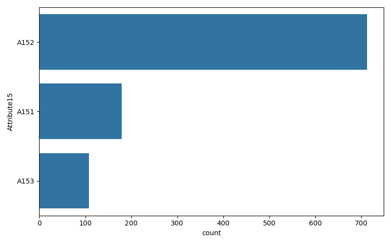
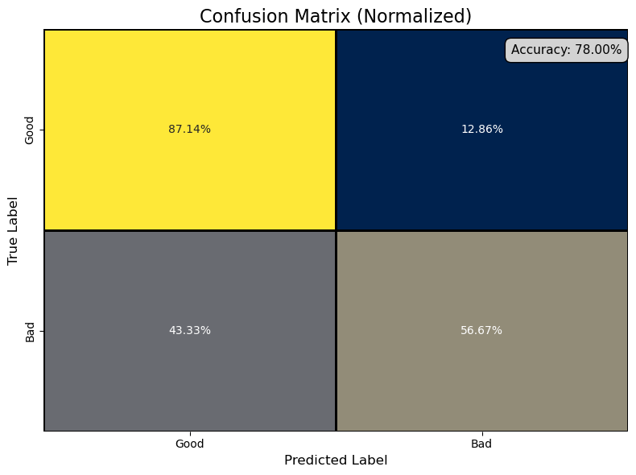
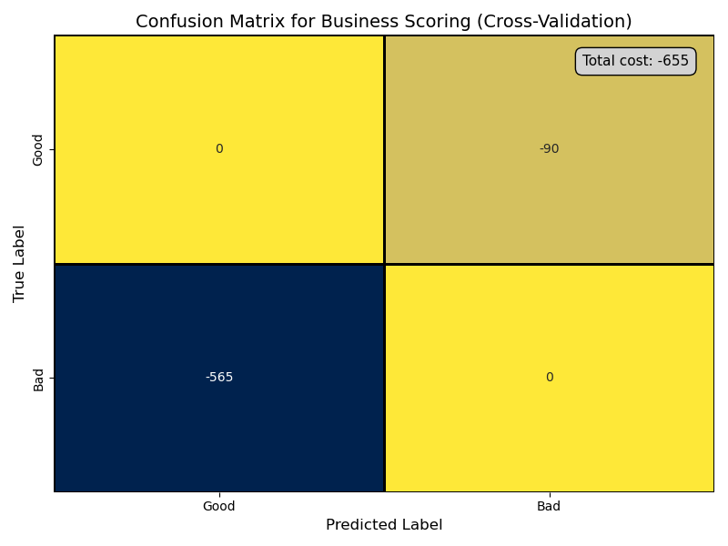
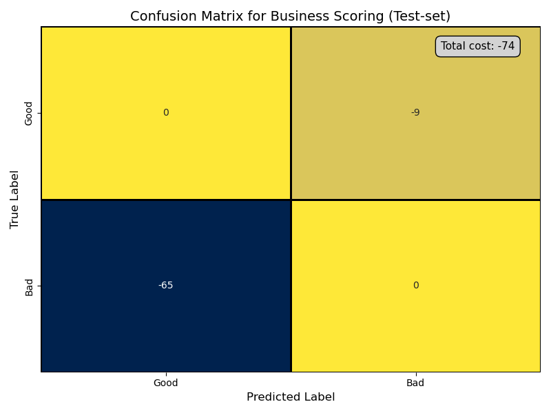

# Credit Scoring
[Statlog (German Credit Data) Data Set”, UCI Machine Learning Repository](https://archive.ics.uci.edu/dataset/144/statlog+german+credit+data)
## Context
Banks play a crucial role in market economies. They decide who can get finance and on what terms and can make or break investment decisions. For markets and society to function, individuals and companies need access to credit.

Credit scoring algorithms, which make a guess at the probability of default, are the method banks use to determine whether or not a loan should be granted.

## Dataset information
The German Credit Data dataset consists of 1,000 subjects and 20 attributes, which include both categorical and numerical features. The dataset is used for binary classification, with the target variable representing credit risk:

- Target:
    - 1 = Good Credit
    - 2 = Bad Credit
### Key Characteristics
- No missing values.
- 13 categorical attributes: These represent various categorical data points such as credit history, employment status, and purpose of the loan.
- 7 numerical attributes: These include numerical values such as credit amount, duration, and age.

## Continuous data distribution

### Attribute 2 (Duration in months)

- The data seems to be skewed right, with most of the values concentrated between 10 and 25.
- There are a few instances beyond 30, but the frequency significantly drops as values increase.
- The distribution suggests a heavy concentration in lower values, possibly indicating a majority of smaller or lower amounts for this feature.
### Attribute 5 (Credit amount)

- The data is highly skewed to the right, with most of the values concentrated between 0 and 2500.
- The majority of observations are concentrated below 7500, it is to say, there is a heavy concentration in lower values. 
### Attribute 8 (Installment rate in percentage of disposable income)

- This appears to be a categorical variable represented by numerical values (1.0 to 4.0).
- Most of the observations fall into categories 2 and 4, with fewer instances in categories 1 and 3.
- The distribution is more uniform than continuous features but shows a preference for certain categories.
### Attribute 11 (Present residence since)

- Similar to Attribute 8, this attribute seems to be categorical with numerical representations from 1.0 to 4.0.
- The highest frequencies are in categories 2 and 4, while categories 1 and 3 have fewer entries.
- The pattern indicates certain categories are more common than others.
### Attribute 13 (Age in years)

- The distribution is heavily right-skewed, with most values between 20 and 50.
- The highest peak is around 30, and the frequency gradually declines as values increase.
- This could indicate that the majority of observations are concentrated in a smaller numerical range.
### Attribute 16 (Number of existing credits at this bank)

- This attribute also seems categorical, with most values clustered at 1.0 and 2.0.
- There's a steep drop after these categories, with minimal representation in higher values like 3.0 and 4.0.
- This suggests that most subjects fall within the first two categories of this feature, indicating some predefined classifications in this variable.

### Attribute 18 (Number of people being liable to provide maintenance for)

- It also looks like a categorical attribute, more than a numerical one.
- The majority of observations are concentrated in the category 1.

We standarize the numerical data with **RobustScaler()**.

## Categorical data distribution

### Attribute 1 (Status of Existing Checking Account)

- A14 (No checking account) has the highest count, indicating a significant portion of individuals do not have a checking account.
- A11 (less than 0 DM) and A12 (0 to less than 200 DM) have relatively large populations, suggesting many individuals have limited or no funds in their checking accounts.
- A13 (200 DM or more) has the smallest count, meaning fewer individuals have a stable or well-funded checking account.
### Attribute 3 (Credit History)

- A32 (Existing credits paid back duly till now) dominates, suggesting many individuals have a responsible credit repayment history.
- A34 (Critical account/other credits) is the second highest, implying some individuals have multiple credits, which might pose a risk.
- A33 (Delays in past payments), A31 (All credits paid back duly at this bank), and A30 (No credits taken) have smaller counts but still represent important subsets.
### Attribute 4 (Purpose of Loan)

- A43 (Radio/Television) has the highest count, followed by A40 (New Car) and A42 (Furniture/Equipment), indicating the majority of loans are taken for household goods or personal use.
- Smaller counts for categories like A49 (Business) and A46 (Education) suggest that fewer loans are taken for professional or developmental purposes.
- Loans in this dataset are predominantly for consumer goods rather than for business or education, which might reflect the spending habits or priorities of the population.

**This attribute does not have A47 : (vacation) as the dataset website indicates.**

### Attribute 6 (Savings Account/Bonds)

- A61 (Less than 100 DM) has the highest count by a significant margin, indicating that most individuals have very little in savings.
- A65 (Unknown/No savings account) is also quite large, suggesting a notable portion of individuals don't have formal savings.
- The higher categories such as A62 (100 to 500 DM) and A64 (More than 1000 DM) have smaller populations.
### Attribute 7 (Present Employment Since)

- A73 (1 to less than 4 years) has the highest count, followed by A75 (7 or more years) and A74 (4 to less than 7 years), indicating a stable employment trend in most cases.
- A71 (Unemployed) has the smallest count, showing that few individuals in this dataset are without employment.

### Attribute 9 (Personal status and sex)*

- A93 (male: single) has the highest count, following by  A92 (female: divorced/separated/married)
- A91 (male: divorced/separated) and A94 (male: married/widowed) shows fewer samples. 

**The dataset documentation indicates that there should be 5 categories (A91 to A95), but we observe that category A95 is missing. This could present an issue for deployment, as the model may not handle unseen categories well. Therefore, we have decided to remove this attribute from the dataset.**

### Attribute 10 (Other debtors / guarantors)*

**- Almost the entire dataset has the category A101 ('none') in the guarantor attribute. This indicates that most of the population does not have a guarantor for their credit. This suggests that the feature might not provide much useful information for the model because of its lack of variability.**
### Attribute 12 (Property)

- A123 (car/other assets) has the highest count (~320+), which suggests that a large portion of individuals own a car or other similar assets rather than real estate or other properties.
- A121 (real estate) follows next (~270 counts), indicating a significant number of individuals hold real estate.
- A122 (building society savings/life insurance) has about 200 counts.
- A124 (unknown/no property) is the smallest category (~150 counts), showing that a relatively smaller group lacks any recognized property.
### Attribute 14 (Other installment plans)*

**- Almost the entire dataset has the category A143 ('none') in the attribute. This suggests that the feature might not provide much useful information for the model because of its lack of variability.**
### Attribute 15 (Housing)

- Almost the entire dataset has the category A152('own'), with a 73%.
- The rest is part of A151 ('rent') and A153 ('for free').
- This attribute does not show a lot of variability but it is enough for taking this attribute to train the model.
### Attribute 17 (Job)

- A173 (skilled employee/official) dominates, with over 600 individuals falling into this category. This suggests that most individuals are in stable, skilled employment.
- A172 (unskilled – resident) follows, with around 250 individuals.
- A174 (management/self-employed/highly qualified employee) has about 150 individuals.
- A171 (unemployed/unskilled – non-resident) represents the smallest group, with only about 50 individuals.

This could indicate a population with a predominantly stable job market, with a majority holding middle-tier employment roles.
### Attribute 19 (Telephone)

- A191 (none) shows that around 600 individuals do not have a registered telephone.
- A192 (yes) indicates that approximately 400 individuals have a telephone registered under their name.
### Attribute 20 (Foreign worker)*

**- Almost the entire dataset has the category A201 ('yes') in the attribute. This suggests that the feature might not provide much useful information for the model because of its lack of variability.**

## Target distribution
The target distribution of the dataset is as follows:

The dataset shows an imbalance, with 70% of the instances representing good credit and only 30% representing bad credit. To address this imbalance and ensure that our model doesn't favor the majority class (good credit), we apply SMOTE (Synthetic Minority Over-sampling Technique) to oversample the minority class (bad credit).

The over-sampling is applied after the splitting. The train_test_split used was 10% for test set and stratified. Giving us a quantity for training set:

After SMOTE we have the following distribution:

## Correlation Matrix
Note: To avoid skewing the correlation matrix due to the high class imbalance in the original DataFrame, we must use a subsample of the data. This ensures that our analysis reflects more balanced class distributions.

### Positive Correlations (greater than 0.2):
- Attribute2 (Duration in months) exhibits a correlation of 0.24, indicating a moderate positive relationship with the target class, suggesting that higher values in this attribute are associated with a higher likelihood of being classified as "bad" credit. Meaning that if the credit is longer, is more likely to be "bad".
- Attribute1_A11 (less than 0 DM) shows a stronger positive correlation of 0.31, implying that higher values in this attribute are linked to a greater probability of being classified as "bad" credit.
- Attribute6_A61 (Saving accounts/bonds) also demonstrates a moderate positive correlation of 0.20 with the target class. Meaning that the population without savings are more probably to have a "bad" credit.

### Negative Correlations (less than -0.2):
- Attribute1_A14 (No checking account) has a significant negative correlation of -0.40, suggesting that higher values in this attribute are associated with a decreased likelihood of being classified as "bad" credit (or, conversely, a higher likelihood of being classified as "good" credit).
- Attribute3_A34 (critical account/other credits existing) shows a moderate negative correlation of -0.23, further indicating that higher values in this feature correspond to a lower probability of being in the "bad" credit category. Surprisingly, people with other credits existing are more likely to have a "good" credit.

## t-SNE
t-SNE serves as a powerful exploratory tool that provides a preliminary understanding of your data’s structure, potentially guiding further analysis and modeling efforts **BUT** t-SNE is not a direct indicator of linear or non-linear separability of the data, as its main objective is dimensional reduction for visualization, preserving local proximity relationships, not global ones.

The results indicate that the target classes are very close each other and overlaps in some places, suggesting that our classifier may face challenges in distinguishing between them effectively. However, also the t-SNE analysis reveals that there are any natural clusters or groupings in the data, it could indicate that the data is separable, but we are going to need a complex classifier.

## Classification with XGBoost
We are going to perform the classification with XGBoost. XGBoost (Extreme Gradient Boosting) is an optimized gradient boosting algorithm that is known for its high performance and efficiency. It builds an ensemble of decision trees sequentially, where each new tree corrects errors made by the previous trees. XGBoost incorporates regularization to prevent overfitting and can handle both regression and classification tasks. It is particularly favored in machine learning competitions for its speed and accuracy.
## Cross-validation score
After performing CV, we got the following results:

When comparing our results to the [Baseline Model Performance](https://archive.ics.uci.edu/dataset/144/statlog+german), our model demonstrates a significant improvement:

- **Accuracy: Baseline model achieved 74.8%, while our model achieved 83.9%.**
- **Precision: Baseline model achieved 70.04%, while our model achieved 85.33%.**

## Results for test-set

## Matrix cost in function of business problem
### Business-Centric Cost Matrix
To reflect the business impact of classification errors, we used the following cost matrix:

|               | Predicted Good (1) | Predicted Bad (2) |
|---------------|--------------------|-------------------|
| **Actual Good (1)** | 0                  | 1                 |
| **Actual Bad (2)**  | 5                  | 0                 |

- **1 = Good Credit**
- **2 = Bad Credit**

This matrix illustrates that misclassifying a bad credit customer as good (with a cost of 5) is far more damaging than misclassifying a good credit customer as bad (with a cost of 1). 

In real-world terms, giving credit to a high-risk customer (Bad classified as Good) poses a much greater financial risk than rejecting a low-risk customer (Good classified as Bad).

Our model was evaluated based on this business-specific cost matrix, leading to the following results:

Our model has a total cost of 655 for cross-validation and 74 for test-set. At this stage we don’t know if any other cut-off can lead to a greater gain. To find the optimal one, we need to compute the cost-gain using the business metric for all possible cut-off points and choose the best.

### Precision-Recall Curve
We can visualize our trade-off between precision (the proportion of true positives among predicted positives) and recall (the proportion of true positives among actual positives) at various threshold levels. Each point on the curve represents a different cut-off point for the model's decision threshold, which determines the probability at which a prediction switches from one class to another. By adjusting this cut-off, you can increase precision at the cost of recall, or vice versa. The cut-off points correspond to different levels of posterior probability estimates, ranging from 0 to 1, allowing you to fine-tune model performance based on business needs or risk tolerance.

By default, *model.predict* from sci-kit learn models uses a cut-off point at a probability estimate of 0.5. The metrics for such a cut-off point are reported with the blue dot on the curves: it corresponds to the statistical performance of the model when using *model.predict*.

## Tuning the threshold for cost-sensitive learning
To minimize the cost defined in the business problem, we tune the model’s decision threshold based on the cost-gain metric via cross-validation. By applying TunedThresholdClassifierCV, we compute the cost-gain for all possible cut-off points and optimize the model for this custom business score.

> Best Threshold from CV: 0.03 \
> Best Score from CV: -92.6257475306815

## Final results with tuned model
After tuning, we evaluate the model’s performance by visualizing the business cost for both cross-validation (CV) and test sets.

### Cross-validation score

### Test score

The tuned model now focuses on reducing false positives (classifying bad customers as good), which incurs a higher business cost. However, this also leads to a slight increase in false negatives (classifying good customers as bad). Given our cost matrix—where a false negative incurs a cost of 5 and a false positive incurs a cost of 1—this trade-off is acceptable for our business case.

As a result, we achieve a lower total cost, making the model better suited for this specific scenario.

## Useful Link

[Custom Objective and Evaluation Metric](https://xgboost.readthedocs.io/en/latest/tutorials/custom_metric_obj.html)

