# Fraud Detection in Financial Transactions

## Project Overview

### Objective 

Develop predictive models to identify whether a transaction is fraudulent or legitimate, with a focus on balancing recall and precision.

### Steps and Process:

1. **Data Exploration and Preprocessing:** Analyzed the imbalanced dataset using Exploratory Data Analysis (EDA) to assess the need for cleaning and preprocessing. Visualized data distributions to understand feature importance and correlations with fraud.

2. **Class Imbalance Handling:** Created a balanced sub-dataset using sampling techniques to better explore relationships between features and fraudulent transactions.

3. **Feature Selection and Outlier Removal:** Identified key features and removed outliers to enhance model performance using feature engineering.

4. **Dimensionality Reduction:** Applied techniques like PCA and T-SNE to reduce the feature space and simplify the models while retaining predictive power. This helped to explore whether reducing the feature space could maintain the predictive power while simplifying the model.

5. **Model Development and Evaluation:** Multiple classifiers were evaluated across different metrics, aligning model selection with the specific business requirements (e.g., balancing between high recall for fraud detection and precision to minimize false positives). Metrics such as precision, recall, and the F1 score were closely monitored to ensure that the models perform well under real-world conditions.

### Model Performance:

- **Model 1:**
This model was optimized for both precision and recall, striking a balance between detecting fraud and minimizing false alarms. It achieved an 84% recall on the test set, identifying 82 out of 98 fraudulent transactions out of 56,962 total transactions. This model is well-suited for environments where a moderate trade-off between recall and precision is acceptable.

- **Model 2:**
A more aggressive threshold was applied in this model, prioritizing recall at the expense of precision. It achieved a 91% recall on the test set, detecting 88 out of 98 fraudulent transactions. However, the model experienced a decrease in precision, making it ideal for use cases where maximizing fraud detection is paramount, even if it means more false positives.

---

## Challenges and its solutions

- Imbalanced datasets are those where there is a severe skew in the class distribution, such as 1:100 or 1:1000 examples in the minority class to the majority class. This bias in the training dataset can influence many machine learning algorithms, leading some to ignore the minority class entirely. This is a problem as it is typically the minority class on which predictions are most important. One approach to addressing the problem of class imbalance is to randomly resample the training dataset. The two main approaches to randomly resampling an imbalanced dataset are to delete examples from the majority class, called **undersampling**, and to duplicate examples from the minority class, called **oversampling**. Both techniques can be used for two-class (binary) classification problems and multi-class classification problems with one or more majority or minority classes. Importantly, the change to the class distribution is only applied to the training dataset. The intent is to influence the fit of the models. The resampling is not applied to the test or holdout dataset used to evaluate the performance of a model. (See more in ).

## Dataset overview

The dataset contains 284,807 rows and 31 columns, with no missing values. The features include V1 to V28, time, amount, and a target column labeled "class," where 0 represents a non-fraudulent transaction (99.83%) and 1 indicates a fraudulent transaction (0.173%). The mean transaction amount is 88.35, but due to the imbalanced nature of the data and sensitivity to outliers, the median value of 22 provides a more accurate central tendency. The table below shows the first five samples of the dataset.

<table border="1" class="dataframe">
  <thead>
    <tr style="text-align: right;">
      <th></th>
      <th>Time</th>
      <th>V1</th>
      <th>V2</th>
      <th>V3</th>
      <th>V4</th>
      <th>V5</th>
      <th>V6</th>
      <th>V7</th>
      <th>V8</th>
      <th>V9</th>
      <th>...</th>
      <th>V21</th>
      <th>V22</th>
      <th>V23</th>
      <th>V24</th>
      <th>V25</th>
      <th>V26</th>
      <th>V27</th>
      <th>V28</th>
      <th>Amount</th>
      <th>Class</th>
    </tr>
  </thead>
  <tbody>
    <tr>
      <th>0</th>
      <td>0.0</td>
      <td>-1.359807</td>
      <td>-0.072781</td>
      <td>2.536347</td>
      <td>1.378155</td>
      <td>-0.338321</td>
      <td>0.462388</td>
      <td>0.239599</td>
      <td>0.098698</td>
      <td>0.363787</td>
      <td>...</td>
      <td>-0.018307</td>
      <td>0.277838</td>
      <td>-0.110474</td>
      <td>0.066928</td>
      <td>0.128539</td>
      <td>-0.189115</td>
      <td>0.133558</td>
      <td>-0.021053</td>
      <td>149.62</td>
      <td>0</td>
    </tr>
    <tr>
      <th>1</th>
      <td>0.0</td>
      <td>1.191857</td>
      <td>0.266151</td>
      <td>0.166480</td>
      <td>0.448154</td>
      <td>0.060018</td>
      <td>-0.082361</td>
      <td>-0.078803</td>
      <td>0.085102</td>
      <td>-0.255425</td>
      <td>...</td>
      <td>-0.225775</td>
      <td>-0.638672</td>
      <td>0.101288</td>
      <td>-0.339846</td>
      <td>0.167170</td>
      <td>0.125895</td>
      <td>-0.008983</td>
      <td>0.014724</td>
      <td>2.69</td>
      <td>0</td>
    </tr>
    <tr>
      <th>2</th>
      <td>1.0</td>
      <td>-1.358354</td>
      <td>-1.340163</td>
      <td>1.773209</td>
      <td>0.379780</td>
      <td>-0.503198</td>
      <td>1.800499</td>
      <td>0.791461</td>
      <td>0.247676</td>
      <td>-1.514654</td>
      <td>...</td>
      <td>0.247998</td>
      <td>0.771679</td>
      <td>0.909412</td>
      <td>-0.689281</td>
      <td>-0.327642</td>
      <td>-0.139097</td>
      <td>-0.055353</td>
      <td>-0.059752</td>
      <td>378.66</td>
      <td>0</td>
    </tr>
    <tr>
      <th>3</th>
      <td>1.0</td>
      <td>-0.966272</td>
      <td>-0.185226</td>
      <td>1.792993</td>
      <td>-0.863291</td>
      <td>-0.010309</td>
      <td>1.247203</td>
      <td>0.237609</td>
      <td>0.377436</td>
      <td>-1.387024</td>
      <td>...</td>
      <td>-0.108300</td>
      <td>0.005274</td>
      <td>-0.190321</td>
      <td>-1.175575</td>
      <td>0.647376</td>
      <td>-0.221929</td>
      <td>0.062723</td>
      <td>0.061458</td>
      <td>123.50</td>
      <td>0</td>
    </tr>
    <tr>
      <th>4</th>
      <td>2.0</td>
      <td>-1.158233</td>
      <td>0.877737</td>
      <td>1.548718</td>
      <td>0.403034</td>
      <td>-0.407193</td>
      <td>0.095921</td>
      <td>0.592941</td>
      <td>-0.270533</td>
      <td>0.817739</td>
      <td>...</td>
      <td>-0.009431</td>
      <td>0.798278</td>
      <td>-0.137458</td>
      <td>0.141267</td>
      <td>-0.206010</td>
      <td>0.502292</td>
      <td>0.219422</td>
      <td>0.215153</td>
      <td>69.99</td>
      <td>0</td>
    </tr>
  </tbody>
</table>

## Some useful plots for business practices

1. **Transaction Time Distribution**
    This represents the time at which a transaction occurred. It might be   recorded in hours, minutes, and seconds since the start of a day or in    some other time format.

    Visualizing the distribution of transaction times can reveal patterns   such as:

    - Peak Transaction Hours: Times of day when transactions are most   frequent.
    - Quiet Periods: Times of day when transactions are less frequent.
    - Behavioral Patterns: If there are more transactions at specific times,    it might reflect user behavior or business practices.

    Example: If there are many transactions late at night, it might be worth checking    if this is typical behavior or indicative of potential fraud.

2. **Transaction Amount Distribution**

    This represents the density of transaction amounts in the dataset. It is represented by the currency value.

    Visualizing the distribution of transaction amount can reveal patterns   such as:
    - Identifies Common Amounts: Helps you see which transaction amounts are  most common.
    - Detects Anomalies: Reveals if there are unusual spikes or outliers in   transaction amounts.
    - Insights for Fraud Detection: For fraud detection, you might look for   patterns like very large or very small amounts compared to typical    transactions.
    Example: If most transactions are small but there are occasional very   large transactions, this could be suspicious behavior.

**Central tendency measures:**

| Measure | Definition                          | Sensitive to outliers |          Use When         |
|---------|-------------------------------------|-----------------------|:-------------------------:|
| Mean    | Average of all values.              | Yes                   | Symmetrical Distributions |
| Median  | Middle value when data is sorted.   | No                    | Skewed Distributions      |
| Mode    | Most frequent value in the dataset. | No                    | For Categorical Data      |

**Normal Distribution**

The **normal distribution**, also known as the **Gaussian distribution**, is a continuous probability distribution that is symmetrical about its mean. It is characterized by its bell-shaped curve, which is known as the Gaussian function. The normal distribution is widely used in statistics, natural and social sciences, and is the foundation for many statistical methods.

 Key Properties:

1. **Symmetry**: The normal distribution is perfectly symmetrical around its mean. This means that the left and right halves of the distribution are mirror images of each other.

2. **Mean, Median, and Mode**: In a normal distribution, the mean, median, and mode are all equal and located at the center of the distribution.

3. **Bell-Shaped Curve**: The curve is bell-shaped, with the highest point at the mean. The probability of values decreases as you move away from the mean.

4. **Asymptotic**: The tails of the distribution approach, but never touch, the horizontal axis. This means that there are theoretically no limits to the values that can be observed.

5. **Empirical Rule (68-95-99.7 Rule)**:
   - Approximately **68%** of the data falls within one standard deviation of the mean.
   - Approximately **95%** falls within two standard deviations.
   - Approximately **99.7%** falls within three standard deviations.

The probability density function (PDF) of a normal distribution is given by:

$$ f(x|\mu, \sigma) = \frac{1}{\sigma \sqrt{2\pi}} e^{ -\frac{1}{2} \left( \frac{x - \mu}{\sigma} \right)^2 } $$

where:

- $\mu$ is the **mean**.
- $\sigma$ is the **standard deviation**.
- $\sigma^2$ is the **variance**.
- $x$ is the **variable**.

Examples of Normal Distribution:

1. **Heights of People**: Heights of individuals in a population tend to follow a normal distribution. Most people are of average height, with fewer people being extremely tall or short.
  
2. **Measurement Errors**: Measurement errors in scientific experiments often follow a normal distribution due to the central limit theorem, which states that the sum of many independent and identically distributed random variables tends towards a normal distribution, regardless of the original distribution of the variables.
  
3. **Test Scores**: Standardized test scores (e.g., IQ scores) are often normally distributed, with most students scoring near the average and fewer students scoring extremely high or low.

## Standarization of data

Since not all columns were standarized, we apply RobustScaler() because is less prone to outliers.

## Splitting data

The dataset is split into training, validation, and test sets, with an important focus on maintaining the original distribution of the test set. This ensures a realistic evaluation of the model's performance.

1. Sampling Applied Only to the Training Set: Subsampling or Oversampling techniques are used exclusively on the training set to balance the class distribution, allowing the model to learn patterns in both fraudulent and non-fraudulent transactions.

2. Evaluation on the Original Test Set: The test set remains unaltered, retaining the natural class imbalance. This ensures that model evaluation reflects real-world conditions, where fraudulent transactions are rare.

3. Why Maintain the Original Test Set? The key objective is to train the model on a balanced training set, but test its performance on the original, imbalanced test set. This provides a more accurate measure of how the model will perform in production, where the data remains skewed.

In this project, the *train_test_split* function is used to create the initial data separation. Afterward, *Under-Sampling* or *Over-Sampling* techniques are applied only to the training set to better prepare the model, while testing is always done on the original test set for realistic results.

## Correlation Matrices

We want to know if there are features that influence heavily in whether a specific transaction is a fraud. It is important that we use the correct dataframe (subsample) in order for us to see which features have a high positive or negative correlation with regards to fraud transactions. The question we must do is: Is this portion of data enough to explain or differentiate from our task?

A correlation matrix is a table that shows the correlation coefficients between multiple variables. Each cell in the matrix displays the correlation between two variables. The value of the correlation coefficient ranges from -1 to 1:

- +1 indicates a perfect positive linear relationship.
- 0 indicates no linear relationship.
- -1 indicates a perfect negative linear relationship.

Importance of the Correlation Matrix

- Understanding Relationships: It helps in identifying the strength and direction of relationships between pairs of variables.
- Feature Selection: Highly correlated features might be redundant. Dropping one of them can simplify the model without losing much information.
- Multicollinearity Detection: In regression analysis, multicollinearity occurs when predictor variables are highly correlated. This can inflate the variance of the coefficient estimates and make the model unstable.

What correlation method exists? There are different correlation methods that pandas allows. For instance, on [pandas documentation](https://pandas.pydata.org/docs/reference/api/pandas.DataFrame.corr.html) says:

> - pearson : standard correlation coefficient
> - kendall : Kendall Tau correlation coefficient
> - spearman : Spearman rank correlation
> - callable: callable with input two 1d ndarrays and returning a float. Note that the returned matrix from corr will have 1 along the diagonals and will be symmetric regardless of the callable’s behavior.

What are these coefficients and what is the meaning?

### 1. Pearson Correlation Coeficient

 The Pearson correlation coefficient measures the linear relationship between two continuous variables:

**Definition**: The Pearson correlation coefficient measures the linear relationship between two continuous variables.

**Formula**:

$$ \rho(X, Y) = \frac{\text{cov}(X, Y)}{\sigma_X \sigma_Y} $$

where:

- $\text{cov}(X, Y)$ is the covariance of variables $X$ and $Y$
- $\sigma_X$ and $\sigma_Y$ are the standard deviations of $X$ and $Y$, respectively

**Characteristics**:

- **Range**: -1 to 1
- **Interpretation**:
  - +1: Perfect positive linear relationship
  - 0: No linear relationship
  - -1: Perfect negative linear relationship
- **Assumptions**:
  - Both variables should be normally distributed (for accurate interpretation).
  - The relationship should be linear.
  - Sensitive to outliers.

*Covariance and Standard deviation definition reminder:*
> Covariance is a measure of how two variables change together. It indicates the direction of the linear relationship between the variables. If the variables tend to increase or decrease together, the covariance is positive. If one variable tends to increase when the other decreases, the covariance is negative.
> Standard deviation (SD) is a measure of the amount of variation or *dispersion of a set of values*. It indicates how spread out the values in a data set are from the mean. High SD means hat data points are spread out over a wider range of values. Low SD indicates that data points are closer to the mean.

### 2. Kendall Tau Correlation Coefficient

**Definition**: The Kendall Tau correlation coefficient measures the ordinal association between two variables. It assesses how well the relationship between two variables can be described using a monotonic function.

**Formula**:

$$ \tau = \frac{(C - D)}{\sqrt{(C + D + T_X)(C + D + T_Y)}} $$

where:

- $C$ is the number of concordant pairs
- $D$ is the number of discordant pairs
- $T_X$ and $T_Y$ are the number of ties in $X$ and $Y$, respectively

**Characteristics**:

- **Range**: -1 to 1
- **Interpretation**:
  - +1: Perfect agreement between rankings
  - 0: No association between rankings
  - -1: Perfect disagreement between rankings
- **Assumptions**:
  - Non-parametric (no specific distribution assumptions).
  - More robust to outliers than Pearson.

*Concordant/Discordant definition reminder*:
> A pair of observations $(X_i, Y_i)$ and $(X_j, Y_j)$ is **concordant** if $X_i > X_j$ and $Y_i > Y_j$, or $X_i < X_j$ and $Y_i < Y_j$.
> A pair of observations $(X_i, Y_i)$ and $(X_j, Y_j)$ is **discordant** if $X_i > X_j$ and $Y_i < Y_j$, or $X_i < X_j$ and $Y_i > Y_j$.
> Ties in X are number of pairs where the values of $X$ are the same, i.e., $X_i = X_j$.
> Ties in Y are number of pairs where the values of $Y$ are the same, i.e., $Y_i = Y_j$.

### 3. Spearman Rank Correlation

**Definition**: The Spearman rank correlation assesses how well the relationship between two variables can be described using a monotonic function. It converts the variables to ranks and then computes the Pearson correlation coefficient on the ranks.

**Formula**:

$$ \rho = 1 - \frac{6 \sum d_i^2}{n(n^2 - 1)} $$

where:

- $d_i$ is the difference between the ranks of each pair of observations
- $n$ is the number of observations

**Characteristics**:

- **Range**: -1 to 1
- **Interpretation**:
  - +1: Perfect positive monotonic relationship
  - 0: No monotonic relationship
  - -1: Perfect negative monotonic relationship
- **Assumptions**:
  - Non-parametric.
  - Can capture non-linear monotonic relationships.
  - More robust to outliers than Pearson.

*Ranks definition reminder:*
> Ranks represent the ordinal position of a value within a sorted list of values. When data is ordered, the smallest value gets the rank of 1, the second smallest gets rank 2, and so forth.
> Raw Scores
> | Student | Score |
> |---------|-------|
> | A       | 85    |
> | B       | 90    |
> | C       | 78    |
> | D       | 92    |
> | E       | 85    |
>
> Sorted Scores with Ranks
> | Student | Score | Rank |
> |---------|-------|------|
> | C       | 78    | 1    |
> | A       | 85    | 2.5  |
> | E       | 85    | 2.5  |
> | B       | 90    | 4    |
> | D       | 92    | 5    |
>
> The scores of 85 are tied, so they get the average of ranks 2 and 3, which is 2.5.

### When to Use Each Correlation Method

1. **Pearson Correlation**:
   - Use when you assume a linear relationship between the variables.
   - Suitable for normally distributed data.
   - Sensitive to outliers.

2. **Kendall Tau Correlation**:
   - Use for ordinal data or when you need a measure of association that is more robust to outliers and non-normal distributions.
   - Suitable for small sample sizes and when there are many ties.

3. **Spearman Rank Correlation**:
   - Use when the relationship between the variables is monotonic but not necessarily linear.
   - Suitable for ordinal data or continuous data that do not meet the assumptions of Pearson.
   - Robust to outliers and non-normal distributions.

Positive Correlation between features and class (Higher than 0.6):

- V4: 0.71
- V11: 0.69

Negative Correlation between features and class (Lower than -0.6):

- V10: -0.62
- V12: -0.68
- V14: -0.75

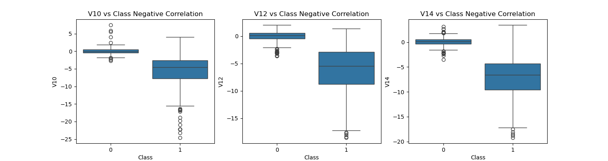

## Distribution visualization

- Kernel Density Estimate (KDE): The KDE line (smooth curve) represents a non-parametric way to estimate the probability density function of a random variable. It's a smoothed version of the histogram that can provide a more accurate representation of the data distribution.
- Normal Distribution Fit: The normal distribution fit line (dashed curve) represents the theoretical normal distribution based on the mean and standard deviation of the data.

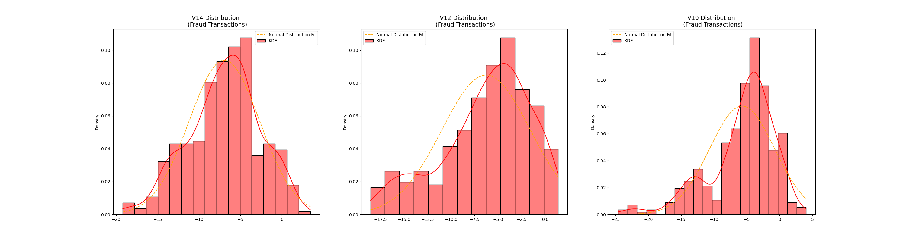

## Anomaly Detection

Inspecting the correlation boxplot we can see that there are a lot of negative outliers. We are going to remove them with Interquartile Range Method (IRM). I think also is possible to do the same with V11 vs Class Positive but we are not going to do it. The methodology is exaclty the same.

Outliers can have many causes, such as:

- Measurement or input error.
- Data corruption.
- True outlier observation (e.g. Michael Jordan in basketball or Juan Roman Riquelme in free throws).

Removing extreme outliers from features that have a high correlation with our classes could be crucial for several reasons:

1. **Improves Model Performance reducing Bias**: Outliers can influence the model's learning process. Since these points are far from the majority of the data, they can pull the model's decision boundary in a wrong direction, leading to biased predictions. Features with high correlation to the class variable have a strong influence on the model's decisions. Removing outliers in these features specifically helps mitigate this biasing effect and allows the model to learn a more accurate representation of the relationship between the feature and the class.
2. **Improves Model Generalizability**:  If extreme outliers represent errors in data collection or measurement, these errors can confuse the model and make it less generalizable to unseen data.

However, this does not mean that the values identified are outliers and should be removed. A good approach is to consider plotting the identified outlier values, perhaps in the context of non-outlier values to see if there are any systematic relationship or pattern to the outliers. If there is, perhaps they are not outliers and can be explained, or perhaps the outliers themselves can be identified more systematically.

### Interquartile Range Method

- Interquartile Range (IQR): We calculate this by the difference between the 75th percentile and 25th percentile. Our aim is to create a threshold beyond the 75th and 25th percentile that in case some instance pass this threshold the instance will be deleted.
- Boxplots: Besides easily seeing the 25th and 75th percentiles (both end of the squares) it is also easy to see extreme outliers (points beyond the lower and higher extreme).

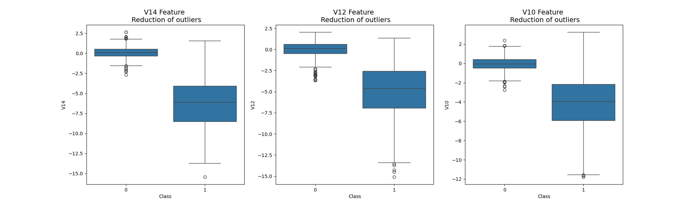

## Dimensionality Reduction and Clustering

> Dimensionality reduction and clustering gives us an indication that further predictive models will perform pretty well in separating fraud cases from non-fraud cases.

### t-SNE

t-SNE (t-distributed Stochastic Neighbor Embedding) takes a high dimensional data set and reduces it to a low dimensional graph that retains a lot of the original information. What T-SNE does is find a way to project data into a low dimensional space so the clustering in the high dimensional space is preserved.

#### High-Dimensional Space:

- In the original high-dimensional space, t-SNE measures pairwise similarities between data points.
- Similarities are modeled using a probability distribution that measures the likelihood of points being close to each other.

#### Low-Dimensional Space:

- t-SNE aims to map the data points to a lower-dimensional space (typically 2D or 3D) while preserving the structure (local relationships) of the high-dimensional data.

#### Steps in t-SNE:

1. Compute Pairwise Affinities in High-Dimensional Space:

   - For each pair of data points $i$ and $j$ in the high-dimensional space, compute the conditional probability $p_{j|i}$ that point $j$ would pick point $i$ as its neighbor given a Gaussian distribution centered at $i$. The similarity $p_{ij}$ is then symmetrized:

     $$p_{ij} = \frac{p_{j|i} + p_{i|j}}{2n}$$
     
   - The perplexity parameter controls the effective number of neighbors considered for each point.

2. Define Pairwise Affinities in Low-Dimensional Space:
   - In the low-dimensional space, the similarity between points $i$ and $j$ is modeled using a Student's t-distribution with one degree of freedom (which has heavier tails than a Gaussian):

     $$q_{ij} = \frac{(1 + \|y_i - y_j\|^2)^{-1}}{\sum_{k \neq l} (1 + \|y_k - y_l\|^2)^{-1}}$$

   - Here, $y_i$ and $y_j$ are the low-dimensional counterparts of the high-dimensional points $x_i $ and $x_j$.

3. Minimize the Kullback-Leibler Divergence:
   - The positions in the low-dimensional space are found by minimizing the Kullback-Leibler (KL) divergence between the joint probabilities $P$ and $Q$:

     $$KL(P \| Q) = \sum_{i \neq j} p_{ij} \log \frac{p_{ij}}{q_{ij}}$$

   - This minimization is typically performed using gradient descent, iteratively adjusting the positions of points in the low-dimensional space to better match the high-dimensional similarities.

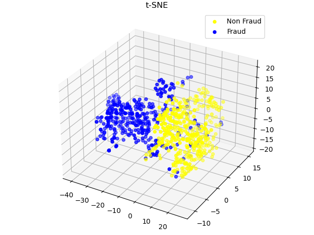

### PCA (Principal Component Analysis)

PCA is used to reduce the dimensionality of a dataset while preserving as much variance as possible. It transforms the data into a new coordinate system where the axes (principal components) are ordered by the amount of variance they capture.

## Steps in PCA

### 1. Standardize the Data

First, standardize the data to have zero mean and unit variance. This step is crucial if the features have different units.

Let $\mathbf{X}$ be the $n \times p$ data matrix where $n$ is the number of observations and $p$ is the number of features. 

Standardize the data:

$$\mathbf{X}_{\text{std}} = \frac{\mathbf{X} - \mu}{\sigma}$$

where $\mu $ is the mean vector and $\sigma $ is the standard deviation vector of each feature.

### 2. Compute the Covariance Matrix

Calculate the covariance matrix of the standardized data:

$$ \mathbf{C} = \frac{1}{n-1} \mathbf{X}_{\text{std}}^T \mathbf{X}_{\text{std}} $$

where $\mathbf{C}$ is a $p \times p$ matrix.

### 3. Compute the Eigenvalues and Eigenvectors

Find the eigenvalues and eigenvectors of the covariance matrix $\mathbf{C}$. This involves solving:

$$\mathbf{C} \mathbf{v} = \lambda \mathbf{v}$$

where $\mathbf{v}$ is an eigenvector and $\lambda$ is the corresponding eigenvalue.

### 4. Sort the Eigenvalues and Eigenvectors

Sort the eigenvalues in descending order and reorder the eigenvectors accordingly. Let $\mathbf{V}$ be the matrix whose columns are the sorted eigenvectors.

### 5. Transform the Data

Project the original data onto the new feature space defined by the eigenvectors. Choose the top $k$ eigenvectors (principal components) where $k$ is the number of dimensions to reduce to. The transformation is:

$$ \mathbf{X}_{\text{reduced}} = \mathbf{X}_{\text{std}} \mathbf{V}_{k} $$

where $\mathbf{V}_{k}$ is the matrix containing the top $k$  eigenvectors.

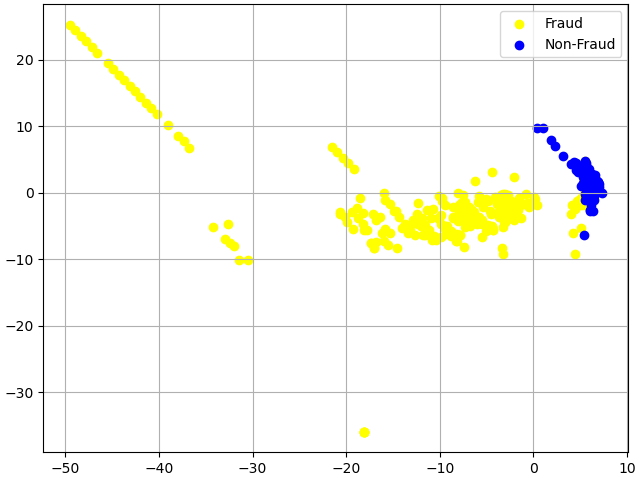

## Classification task

After successfully removing outliers and applying dimensionality reduction techniques, we proceeded to the classification task. The goal is to evaluate several classifiers to determine which performs best in detecting fraudulent transactions.

### Classifiers 

  1. K-Nearest Neighbors (KNN): The KNeighborsClassifier with k=3 was used to classify transactions based on proximity to known examples. KNN is simple and intuitive, making it a good baseline for comparison.
  2. Support Vector Classifier (SVC): The SVC with a linear kernel was implemented. SVCs are effective in high-dimensional spaces and are well-suited for datasets with clear class separation, even in imbalanced scenarios.
  3. Random Forest: A RandomForestClassifier with max_depth=5, n_estimators=10, max_features=1 was applied. Random forests are robust ensemble models that reduce overfitting and handle class imbalance well by aggregating the results of multiple decision trees.
  4. Logistic Regression: Logistic regression, a widely used linear classifier, was included for its interpretability and effectiveness in binary classification tasks. It's known for handling large feature spaces and can serve as a benchmark for more complex models.
  5. Gaussian Naive Bayes: This probabilistic classifier assumes independence among features and is effective when the dataset satisfies this assumption. It's computationally efficient and performs well on smaller datasets or when feature independence holds true.

Each classifier was trained on a balanced training set using undersampling techniques and tested on the original, imbalanced test set to ensure realistic performance evaluation.

### Metrics

To evaluate the effectiveness of the classifiers, the following metrics were used.

1. **Precision:** Measures the proportion of true positive predictions (fraud detected correctly) out of all positive predictions (both true and false positives). It answers the question: "Of all the transactions predicted as fraud, how many were actually fraudulent?"

  $$ \mathbf{Precision} = \frac{TP}{TP + FP} $$

  - TP: True Positives (correctly classified frauds)
  - FP: False Positives (non-fraudulent transactions misclassified as fraud).

  In fraud detection, precision is important because false positives (non-fraud labeled as fraud) can cause unnecessary actions, such as customer dissatisfaction due to wrongly flagged transactions, or a big waste of time and money.

2. **Recall:** (also known as sensitivity or true positive rate) measures the proportion of actual fraud cases that were correctly identified by the model. It answers: "Of all the actual frauds, how many were caught?"

  $$ \mathbf{Recall} = \frac{TP}{TP + FN} $$

  - FN: False Negatives (fraudulent transactions missed by the model).

  High recall is crucial in fraud detection because missing a fraudulent transaction (false negative) can lead to financial loss.

3. **F1 score:** Is the harmonic mean of precision and recall. It balances the two metrics and provides a single score to evaluate the model's overall performance when both false positives and false negatives matter.

  $$ \mathbf{F1} = 2\times\frac{Precision \times Recall}{Precision + Recall} $$
  
  The F1 score is particularly useful when you want to strike a balance between precision and recall.

4. **F2 score:** The F2 score is a variant of the F1 score that weights recall higher than precision. It is useful when missing fraudulent transactions (false negatives) is more costly than raising false alarms (false positives).

 $$ \mathbf{F2} = (1+2^2)\times\frac{Precision \times Recall}{4 \times Precision + Recall} $$

  This score is valuable when the business goal prioritizes catching as many fraud cases as possible, even if it results in more false positives.

#### Importance of *average='weighted'*
In imbalanced datasets like fraud detection, where non-fraudulent transactions dominate, using average='weighted' ensures that the performance of each class is accounted for based on its frequency in the dataset. Without this weighting, a model that performs well on the majority class (non-fraud) but poorly on the minority class (fraud) could appear to have good overall metrics.

By using average='weighted', the metrics reflect the performance across both classes, preventing the model’s score from being skewed by the dominant class. This is essential in fraud detection, where the minority class (fraud) is the critical focus, despite being underrepresented.

## Learning Curves

Learning curves are essential tools for diagnosing the performance of machine learning models and understanding their behavior as the amount of training data increases. By analyzing learning curves, one can draw several important conclusions:

Model Performance and Generalization:

- High Training and Test Scores: If both the training and test scores are high and close to each other, the model is performing well and generalizing effectively to unseen data. This indicates that the model has found a good balance between bias and variance.
- Low Training and Test Scores: If both scores are low, the model is underfitting, meaning it is too simple to capture the underlying patterns in the data (high bias). Adding more features, increasing model complexity, or trying different algorithms might help improve performance.

Overfitting and Underfitting:

- Large Gap Between Training and Test Scores: A significant difference between high training scores and lower test scores suggests that the model is overfitting the training data (high variance). The model is capturing noise and specific patterns in the training data that do not generalize to new data. Techniques like regularization, pruning, or using simpler models can help mitigate overfitting.
- Small or No Gap with Low Scores: When both training and test scores are similarly low, the model is underfitting, indicating that it is not complex enough to learn the underlying structure of the data. Increasing the model complexity or trying more sophisticated algorithms can help address underfitting.

Effect of Training Data Size:

- Improvement with More Data: If the test score improves as the training set size increases, the model benefits from more data and is likely to generalize better. This is often seen in models that initially overfit but learn to generalize as they are exposed to more data.
- Plateauing Performance: When both training and test scores plateau, increasing the amount of data further may not lead to significant improvements in model performance. This suggests that the model has reached its capacity for learning from the available features, and other techniques such as feature engineering or trying different algorithms might be needed to boost performance.

Bias-Variance Tradeoff:

- Learning curves help visualize the bias-variance tradeoff in a model. A high bias model (underfitting) can be identified by low training and test scores, while a high variance model (overfitting) shows a large gap between high training scores and lower test scores. The goal is to find a balance where the model achieves high scores on both training and test sets, indicating low bias and low variance.

### Classifiers performance for under-sampling technique:

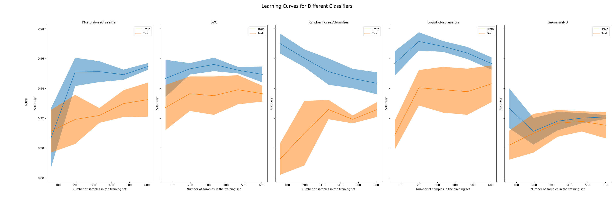

1. KNeighborsClassifier:

- Training Accuracy: Starts very high, suggesting the model fits the training data well.
- Test Accuracy: Initially much lower, but improves with more data, narrowing the gap between train and test scores.
- Conclusion: Initially overfitting, but generalization improves as more data is provided. Eventually, it seems to balance, but there's still a gap that indicates slight overfitting.

2. SVC (Support Vector Classifier):

- Training Accuracy: High but decreases slightly as more data is added.
- Test Accuracy: Starts low and improves as training set size increases.
- Conclusion: This suggests the model may benefit from more data. The consistent gap indicates it may be slightly overfitting but could generalize better with even more data.

3. RandomForestClassifier:

- Training Accuracy: Very high but decreases slightly as more samples are added.
- Test Accuracy: Improves with more data but there's a notable gap.
- Conclusion: The Random Forest is clearly overfitting, especially on smaller datasets. However, with more data, generalization improves, though the gap remains.

4. LogisticRegression:

- Training Accuracy: Starts high and remains relatively stable.
- Test Accuracy: Starts lower but increases with more data.
- Conclusion: Logistic regression shows good generalization with smaller data sets. There's minimal overfitting, but a modest improvement in generalization with more data.

5. GaussianNB:

- Training Accuracy: Low initially, improves with more data, then declines slightly.
- Test Accuracy: Starts very low, rises but remains unstable with high variance.
- Conclusion: GaussianNB struggles with both training and generalization. It may be underfitting the data due to its assumptions (e.g., that the features are normally distributed).

**General Conclusions for Learning Curve:**

- Overfitting: Models like KNeighbors, RandomForest, and SVC tend to overfit initially, as indicated by the large gap between the training and test scores, which decreases as more training data is added.

- Underfitting: GaussianNB shows signs of underfitting as it struggles to achieve good performance on both the training and test sets.

- Impact of More Data: For most models (SVC, RandomForest, LogisticRegression), adding more data improves test accuracy and narrows the gap between the training and test scores, suggesting that these models benefit from more training data.

- Stability: Logistic Regression shows a more stable performance across different data sizes, indicating that it's a relatively consistent model, with limited overfitting.

### Bias vs Variance definition
- **Bias:** It is related to the assumptions made by the model to learn the target function. Often related to training set. High bias means too simplistic and does not capture the complexity of the data, leading underfitting.

- **Variance:** It is the amount by which the model's predictions would change if it were trained on a different dataset. Often related to test error: If the model has high variance, means that is too complex and fits the training data very closely, capturing noise as well. Whereas a low variance means that the model is less sensitive to the specifics of the training data and generalizes well to unseen data. This typically results in more similar training and test errors.

**Bias-Variance Tradeoff**

The bias-variance tradeoff is the balance that needs to be achieved to minimize the total error in a model. Ideally, we want a model with both low bias and low variance, but in practice, reducing one often increases the other.

High Bias, Low Variance: A simple model that does not fit the training data well and fails to capture the underlying patterns (underfitting), but having consistent results.
Low Bias, High Variance: A complex model that fits the training data too well and does not generalize to new data (overfitting).
The goal is to find a model complexity that achieves a good tradeoff between bias and variance, leading to low overall error on both training and test data.

## Hyperparameter Tuning - GridSearchCV

Hyperparameter tuning involves finding the best combination of parameters for a machine learning model to improve its performance. Unlike model parameters, which are learned during training (such as weights in logistic regression), hyperparameters are set before the training process begins and control aspects of how the model learns (e.g., regularization strength or optimization algorithm).

GridSearchCV is a method that automates the process of hyperparameter tuning by exhaustively searching through a specified grid of hyperparameters. For each combination of parameters, the model is trained and evaluated using cross-validation, ensuring that the results are more reliable than simply splitting the data once.

In this case, GridSearchCV was used to fine-tune the hyperparameters of the LogisticRegression model. The parameters being tested were:

- **penalty:** Regularization method, here set to 'l2', which is commonly used to prevent overfitting.
- **C:** Inverse of regularization strength, where smaller values specify stronger regularization. The values tested ranged from 1.0 to 0.1.
- **class_weight:** Balances the dataset by assigning different weights to classes. Both 'balanced' and None were tested.
- **solver:** Optimization algorithms used to find the best model parameters. The solvers tested were 'lbfgs', 'liblinear', and 'newton-cholesky'.

Despite running GridSearchCV with these parameters, the performance of the LogisticRegression model might not have improved due to several possible reasons:

- **Feature Complexity:** Logistic Regression is a linear model, which might not capture complex relationships in the data that non-linear classifiers can handle.

- **Hyperparameter Range:** Although different regularization strengths and solvers were tested, they may not have a significant impact on the model's performance for this specific dataset. The variations in hyperparameters might not have been enough to produce noticeable improvements.

- **Imbalanced Data:** Even though the model was tested with class_weight='balanced', Logistic Regression may struggle with highly imbalanced datasets, as it might not effectively separate the minority class (fraudulent transactions) from the majority class.

- **Under Sampling Impact:** The under sampling techniques used earlier may have removed critical information, limiting the Logistic Regression model's ability to improve performance.

In cases where tuning doesn’t lead to improvements, more complex models like Random Forests or SVC may better capture patterns in the data.

**The results of the Logistic Regression with under-sampling technique are showed in results section**

## Combining Under-Sampling and Over-Sampling techniques

In order to address the class imbalance in the dataset more effectively, a combination of Random Under-Sampling and SMOTE (Synthetic Minority Over-sampling Technique) was used. This approach aims to balance the dataset while preserving valuable information from both classes.

The pipeline created uses both sampling techniques in sequence:
1. **Random Under-Sampling:** This technique reduces the majority class (non-fraudulent transactions) by randomly selecting a subset, which helps prevent overwhelming the model with non-fraud cases.
2. **SMOTE:** After under-sampling, SMOTE generates synthetic samples for the minority class (fraudulent transactions) by interpolating between existing fraud examples. This helps the model learn more generalized patterns for detecting fraud.
3. **Classifier:** The classifier used in this pipeline is LogisticRegression.

### GridSearchCV and Metrics

To fine-tune the model, GridSearchCV was applied to the pipeline. Two different evaluation metrics were used to optimize the model according to different business needs.

1. **First Approach - F1 Weighted:**

   The first objective was to balance precision and recall by optimizing for the F1 weighted score, which accounts for the class imbalance. This approach aims to achieve a good trade-off between catching fraud (high recall) while keeping false positives (low precision) under control.

   **Why F1 Weighted?**

   In fraud detection, both false positives and false negatives are costly. By using F1 weighted, the goal was to ensure that both precision and recall were considered, balancing the need to catch fraud without flagging too many legitimate transactions as fraudulent.

2. **Second Approach - Recall:**

    In the second approach, the focus was shifted to maximizing recall. The goal was to catch as many fraudulent transactions as possible, even if it meant sacrificing precision. This approach is ideal when missing a fraud case (false negatives) is far more costly than misclassifying non-fraud transactions as fraud (false positives).

    **Why Prioritize Recall?**

    In situations where failing to detect fraud can lead to significant financial losses, maximizing recall is critical. This ensures the model flags most fraud cases, even at the expense of triggering more false alarms.

**The results of the both models are showed in results section**

## Results

The following tools were utilized to assess the performance of the various models trained with the characteristics detailed previously:

**Confusion Matrix**: is a performance measurement tool for classification models. It provides a visual representation of the actual versus predicted classifications, enabling an assessment of how well the model is performing. The matrix consists of four key components:

- True Positives (TP): Correctly predicted positive instances.
- False Positives (FP): Negative instances incorrectly predicted as positive.
- True Negatives (TN): Correctly predicted negative instances.
- False Negatives (FN): Positive instances incorrectly predicted as negative.

By analyzing these components, the confusion matrix helps identify specific types of classification errors and informs decisions on model optimization.

**Precision-Recall (PR) Curve** is a graphical representation that illustrates the trade-off between precision and recall for a classification model at various thresholds. It is especially useful in imbalanced datasets where the positive class (e.g., fraud) is rare.

- Precision: The ratio of true positive predictions to the total positive predictions.
- Recall: The ratio of true positive predictions to the total actual positive instances.

The PR curve is created by plotting precision against recall for different thresholds, allowing for a comprehensive evaluation of the model's performance. A model that achieves high precision and recall will display a curve that is close to the top right corner of the graph.

### Under-Sampling Technique
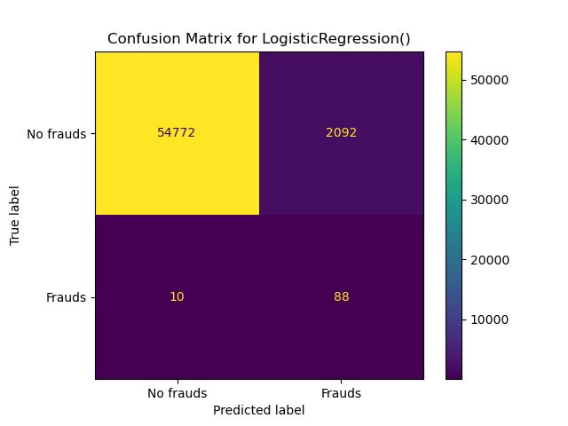
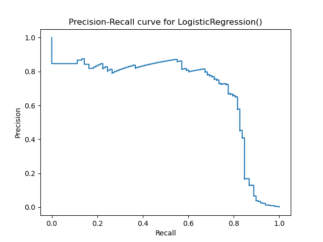

|         |    pre |    rec |    spe |    f1 |    geo |    iba |   sup |
|---------|--------|--------|--------|-------|--------|--------|-------|
| **0**   |  1.00  |  0.96  |  0.90  |  0.98 |  0.93  |  0.87  | 56864 |
| **1**   |  0.04  |  0.90  |  0.96  |  0.08 |  0.93  |  0.86  |   98  |
| avg / total |  1.00  |  0.96  |  0.90  |  0.98 |  0.93  |  0.87  | 56962 |

### Under and Over-Sampling Technique: Best Recall
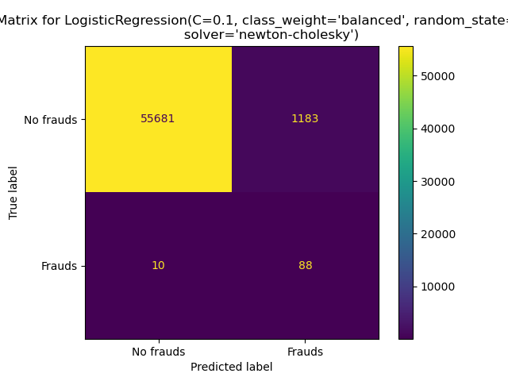
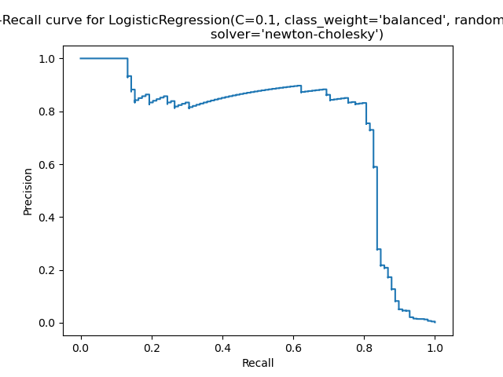

|         |    pre |    rec |    spe |    f1 |    geo |    iba |   sup |
|---------|--------|--------|--------|-------|--------|--------|-------|
| **0**   |  1.00  |  0.98  |  0.90  |  0.99 |  0.94  |  0.89  | 56864 |
| **1**   |  0.07  |  0.90  |  0.98  |  0.13 |  0.94  |  0.87  |   98  |
| avg / total |  1.00  |  0.98  |  0.90  |  0.99 |  0.94  |  0.89  | 5696  |

### Under and Over-Sampling Technique: Good Recall and Good Precision
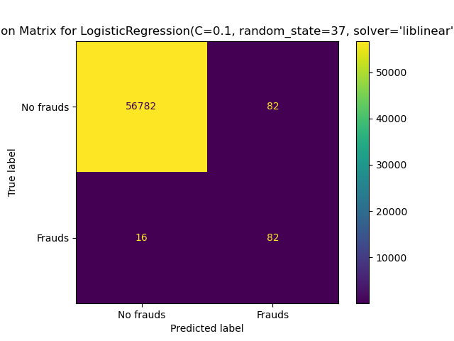
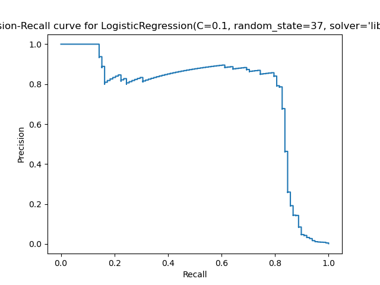

|         |    pre |    rec |    spe |    f1 |    geo |    iba |   sup |
|---------|--------|--------|--------|-------|--------|--------|-------|
| **0**   |  1.00  |  1.00  |  0.84  |  1.00 |  0.91  |  0.85  | 56864 |
| **1**   |  0.50  |  0.84  |  1.00  |  0.63 |  0.91  |  0.82  |   98  |
| avg / total |  1.00  |  1.00  |  0.84  |  1.00 |  0.91  |  0.85  | 56962 |

## Conclusion

In this project, we successfully developed predictive models for detecting fraudulent transactions by implementing a systematic approach that included data exploration, preprocessing, and model evaluation. We addressed the challenges of class imbalance through sampling techniques, which allowed us to create a balanced dataset for training.

Key features were identified and outliers removed to enhance model performance. Dimensionality reduction techniques, such as PCA and T-SNE, were applied to simplify the models while maintaining their predictive capabilities.

The evaluation of multiple classifiers revealed varying levels of performance. Notably, the undersampling method yielded a recall of 90% but with a precision of only 4%, resulting in a high number of false positives. By combining both under-sampling and over-sampling techniques, we improved precision to 7% while maintaining the same recall. Additionally, we developed a model that achieved a balanced trade-off with a recall of 84% and precision of 50, significantly reducing false positives compared to the total number of transactions.

These findings underscore the importance of selecting appropriate metrics and techniques in developing fraud detection models that align with business objectives, striking a balance between catching fraudulent activities and minimizing false alerts.

## Useful links

[Framework for Imbalanced Classification Projects](https://machinelearningmastery.com/framework-for-imbalanced-classification-projects/)
