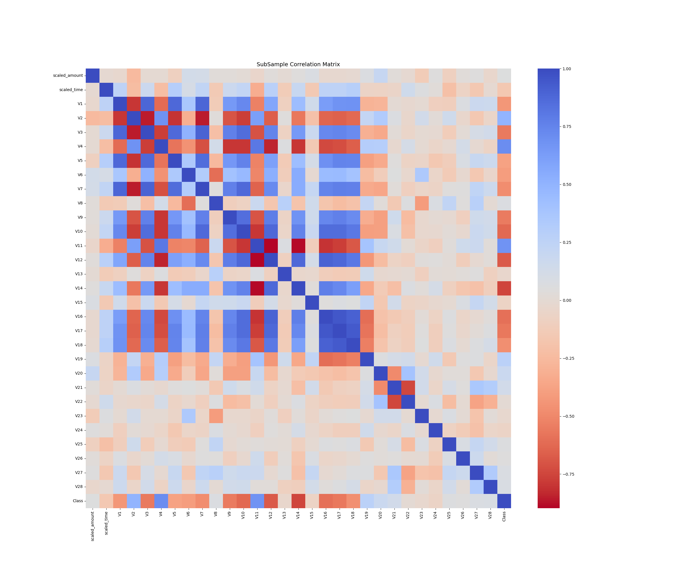
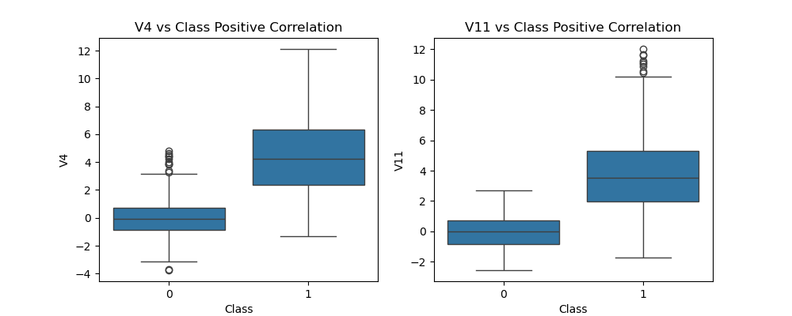
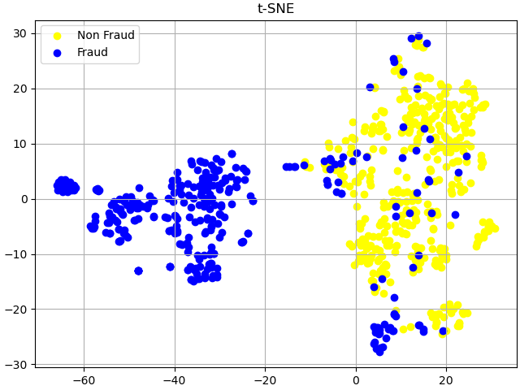

# Fraud Detection in Financial Transactions

## Main idea

Create predictive models to accurately detect whether a transaction is normal or fraudulent. The objectives include understanding the data distribution, creating a balanced sub-dataframe of fraud and non-fraud transactions, determining and evaluating various classifiers for accuracy, developing a neural network to compare its accuracy against the best classifier, and understanding common mistakes associated with imbalanced datasets.

### Challenges and its solutions

1. Imbalanced datasets are those where there is a severe skew in the class distribution, such as 1:100 or 1:1000 examples in the minority class to the majority class. This bias in the training dataset can influence many machine learning algorithms, leading some to ignore the minority class entirely. This is a problem as it is typically the minority class on which predictions are most important. One approach to addressing the problem of class imbalance is to randomly resample the training dataset. The two main approaches to randomly resampling an imbalanced dataset are to delete examples from the majority class, called **undersampling**, and to duplicate examples from the minority class, called **oversampling**. Both techniques can be used for two-class (binary) classification problems and multi-class classification problems with one or more majority or minority classes. Importantly, the change to the class distribution is only applied to the training dataset. The intent is to influence the fit of the models. The resampling is not applied to the test or holdout dataset used to evaluate the performance of a model. (See more in ).

### Dataset example

<table border="1" class="dataframe">
  <thead>
    <tr style="text-align: right;">
      <th></th>
      <th>Time</th>
      <th>V1</th>
      <th>V2</th>
      <th>V3</th>
      <th>V4</th>
      <th>V5</th>
      <th>V6</th>
      <th>V7</th>
      <th>V8</th>
      <th>V9</th>
      <th>...</th>
      <th>V21</th>
      <th>V22</th>
      <th>V23</th>
      <th>V24</th>
      <th>V25</th>
      <th>V26</th>
      <th>V27</th>
      <th>V28</th>
      <th>Amount</th>
      <th>Class</th>
    </tr>
  </thead>
  <tbody>
    <tr>
      <th>0</th>
      <td>0.0</td>
      <td>-1.359807</td>
      <td>-0.072781</td>
      <td>2.536347</td>
      <td>1.378155</td>
      <td>-0.338321</td>
      <td>0.462388</td>
      <td>0.239599</td>
      <td>0.098698</td>
      <td>0.363787</td>
      <td>...</td>
      <td>-0.018307</td>
      <td>0.277838</td>
      <td>-0.110474</td>
      <td>0.066928</td>
      <td>0.128539</td>
      <td>-0.189115</td>
      <td>0.133558</td>
      <td>-0.021053</td>
      <td>149.62</td>
      <td>0</td>
    </tr>
    <tr>
      <th>1</th>
      <td>0.0</td>
      <td>1.191857</td>
      <td>0.266151</td>
      <td>0.166480</td>
      <td>0.448154</td>
      <td>0.060018</td>
      <td>-0.082361</td>
      <td>-0.078803</td>
      <td>0.085102</td>
      <td>-0.255425</td>
      <td>...</td>
      <td>-0.225775</td>
      <td>-0.638672</td>
      <td>0.101288</td>
      <td>-0.339846</td>
      <td>0.167170</td>
      <td>0.125895</td>
      <td>-0.008983</td>
      <td>0.014724</td>
      <td>2.69</td>
      <td>0</td>
    </tr>
    <tr>
      <th>2</th>
      <td>1.0</td>
      <td>-1.358354</td>
      <td>-1.340163</td>
      <td>1.773209</td>
      <td>0.379780</td>
      <td>-0.503198</td>
      <td>1.800499</td>
      <td>0.791461</td>
      <td>0.247676</td>
      <td>-1.514654</td>
      <td>...</td>
      <td>0.247998</td>
      <td>0.771679</td>
      <td>0.909412</td>
      <td>-0.689281</td>
      <td>-0.327642</td>
      <td>-0.139097</td>
      <td>-0.055353</td>
      <td>-0.059752</td>
      <td>378.66</td>
      <td>0</td>
    </tr>
    <tr>
      <th>3</th>
      <td>1.0</td>
      <td>-0.966272</td>
      <td>-0.185226</td>
      <td>1.792993</td>
      <td>-0.863291</td>
      <td>-0.010309</td>
      <td>1.247203</td>
      <td>0.237609</td>
      <td>0.377436</td>
      <td>-1.387024</td>
      <td>...</td>
      <td>-0.108300</td>
      <td>0.005274</td>
      <td>-0.190321</td>
      <td>-1.175575</td>
      <td>0.647376</td>
      <td>-0.221929</td>
      <td>0.062723</td>
      <td>0.061458</td>
      <td>123.50</td>
      <td>0</td>
    </tr>
    <tr>
      <th>4</th>
      <td>2.0</td>
      <td>-1.158233</td>
      <td>0.877737</td>
      <td>1.548718</td>
      <td>0.403034</td>
      <td>-0.407193</td>
      <td>0.095921</td>
      <td>0.592941</td>
      <td>-0.270533</td>
      <td>0.817739</td>
      <td>...</td>
      <td>-0.009431</td>
      <td>0.798278</td>
      <td>-0.137458</td>
      <td>0.141267</td>
      <td>-0.206010</td>
      <td>0.502292</td>
      <td>0.219422</td>
      <td>0.215153</td>
      <td>69.99</td>
      <td>0</td>
    </tr>
  </tbody>
</table>

### Dataset information

- 284807 rows x 31 columns
- The mean of transaction amount is 88.34961925093133. But since it is an imbalanced data, using the average of all values is not the best information about beacuse it is sensitive to ouliers. Median is the best central tendency measure, giving a value of 22.
- No NaN Values in the dataframe.
- You can know if a transaction was a fraud because it has a class column: 0 means non-fraudulent (99.83 %) meanwhile 1 means fraudulent transaction (0.173 %).

## Some useful plots for business practices

1. **Transaction Time Distribution**
    This represents the time at which a transaction occurred. It might be   recorded in hours, minutes, and seconds since the start of a day or in    some other time format.

    Visualizing the distribution of transaction times can reveal patterns   such as:

    - Peak Transaction Hours: Times of day when transactions are most   frequent.
    - Quiet Periods: Times of day when transactions are less frequent.
    - Behavioral Patterns: If there are more transactions at specific times,    it might reflect user behavior or business practices.

    Example: If there are many transactions late at night, it might be worth checking    if this is typical behavior or indicative of potential fraud.

2. **Transaction Amount Distribution**

    This represents the density of transaction amounts in the dataset. It is represented by the currency value.

    Visualizing the distribution of transaction amount can reveal patterns   such as:
    - Identifies Common Amounts: Helps you see which transaction amounts are  most common.
    - Detects Anomalies: Reveals if there are unusual spikes or outliers in   transaction amounts.
    - Insights for Fraud Detection: For fraud detection, you might look for   patterns like very large or very small amounts compared to typical    transactions.
    Example: If most transactions are small but there are occasional very   large transactions, this could be suspicious behavior.

**Central tendency measures:**

| Measure | Definition                          | Sensitive to outliers |          Use When         |
|---------|-------------------------------------|-----------------------|:-------------------------:|
| Mean    | Average of all values.              | Yes                   | Symmetrical Distributions |
| Median  | Middle value when data is sorted.   | No                    | Skewed Distributions      |
| Mode    | Most frequent value in the dataset. | No                    | For Categorical Data      |

**Normal Distribution**

The **normal distribution**, also known as the **Gaussian distribution**, is a continuous probability distribution that is symmetrical about its mean. It is characterized by its bell-shaped curve, which is known as the Gaussian function. The normal distribution is widely used in statistics, natural and social sciences, and is the foundation for many statistical methods.

 Key Properties:

1. **Symmetry**: The normal distribution is perfectly symmetrical around its mean. This means that the left and right halves of the distribution are mirror images of each other.

2. **Mean, Median, and Mode**: In a normal distribution, the mean, median, and mode are all equal and located at the center of the distribution.

3. **Bell-Shaped Curve**: The curve is bell-shaped, with the highest point at the mean. The probability of values decreases as you move away from the mean.

4. **Asymptotic**: The tails of the distribution approach, but never touch, the horizontal axis. This means that there are theoretically no limits to the values that can be observed.

5. **Empirical Rule (68-95-99.7 Rule)**:
   - Approximately **68%** of the data falls within one standard deviation of the mean.
   - Approximately **95%** falls within two standard deviations.
   - Approximately **99.7%** falls within three standard deviations.

The probability density function (PDF) of a normal distribution is given by:

$$ f(x|\mu, \sigma) = \frac{1}{\sigma \sqrt{2\pi}} e^{ -\frac{1}{2} \left( \frac{x - \mu}{\sigma} \right)^2 } $$

where:

- $\mu$ is the **mean**.
- $\sigma$ is the **standard deviation**.
- $\sigma^2$ is the **variance**.
- $x$ is the **variable**.

Examples of Normal Distribution:

1. **Heights of People**: Heights of individuals in a population tend to follow a normal distribution. Most people are of average height, with fewer people being extremely tall or short.
  
2. **Measurement Errors**: Measurement errors in scientific experiments often follow a normal distribution due to the central limit theorem, which states that the sum of many independent and identically distributed random variables tends towards a normal distribution, regardless of the original distribution of the variables.
  
3. **Test Scores**: Standardized test scores (e.g., IQ scores) are often normally distributed, with most students scoring near the average and fewer students scoring extremely high or low.

## Standarization of data

Since not all columns were standarized, we apply RobustScaler() because is less prone to outliers.

### Splitting data

Before applying any under-sampling techniques, it’s crucial to separate the original dataframe. Although we will split the data during the implementation of Random Under-Sampling or Over-Sampling techniques, it is important to remember that we should test our models on the original testing set, not on the subset created by these techniques. The primary objective is to fit the model using the modified dataframes (that have been under-sampled or over-sampled) to help the model detect patterns, and then evaluate its performance on the untouched, original testing set.

## Correlation Matrices

We want to know if there are features that influence heavily in whether a specific transaction is a fraud. It is important that we use the correct dataframe (subsample) in order for us to see which features have a high positive or negative correlation with regards to fraud transactions. The question we must do is: Is this portion of data enough to explain or differentiate from our task?

A correlation matrix is a table that shows the correlation coefficients between multiple variables. Each cell in the matrix displays the correlation between two variables. The value of the correlation coefficient ranges from -1 to 1:

- +1 indicates a perfect positive linear relationship.
- 0 indicates no linear relationship.
- -1 indicates a perfect negative linear relationship.

Importance of the Correlation Matrix

- Understanding Relationships: It helps in identifying the strength and direction of relationships between pairs of variables.
- Feature Selection: Highly correlated features might be redundant. Dropping one of them can simplify the model without losing much information.
- Multicollinearity Detection: In regression analysis, multicollinearity occurs when predictor variables are highly correlated. This can inflate the variance of the coefficient estimates and make the model unstable.

What correlation method exists? There are different correlation methods that pandas allows. For instance, on [pandas documentation](https://pandas.pydata.org/docs/reference/api/pandas.DataFrame.corr.html) says:

> - pearson : standard correlation coefficient
> - kendall : Kendall Tau correlation coefficient
> - spearman : Spearman rank correlation
> - callable: callable with input two 1d ndarrays and returning a float. Note that the returned matrix from corr will have 1 along the diagonals and will be symmetric regardless of the callable’s behavior.

What are these coefficients and what is the meaning?

### 1. Pearson Correlation Coeficient

 The Pearson correlation coefficient measures the linear relationship between two continuous variables:

**Definition**: The Pearson correlation coefficient measures the linear relationship between two continuous variables.

**Formula**:

$$ \rho(X, Y) = \frac{\text{cov}(X, Y)}{\sigma_X \sigma_Y} $$

where:

- $\text{cov}(X, Y)$ is the covariance of variables $X$ and $Y$
- $\sigma_X$ and $\sigma_Y$ are the standard deviations of $X$ and $Y$, respectively

**Characteristics**:

- **Range**: -1 to 1
- **Interpretation**:
  - +1: Perfect positive linear relationship
  - 0: No linear relationship
  - -1: Perfect negative linear relationship
- **Assumptions**:
  - Both variables should be normally distributed (for accurate interpretation).
  - The relationship should be linear.
  - Sensitive to outliers.

*Covariance and Standard deviation definition reminder:*
> Covariance is a measure of how two variables change together. It indicates the direction of the linear relationship between the variables. If the variables tend to increase or decrease together, the covariance is positive. If one variable tends to increase when the other decreases, the covariance is negative.
> Standard deviation (SD) is a measure of the amount of variation or *dispersion of a set of values*. It indicates how spread out the values in a data set are from the mean. High SD means hat data points are spread out over a wider range of values. Low SD indicates that data points are closer to the mean.

### 2. Kendall Tau Correlation Coefficient

**Definition**: The Kendall Tau correlation coefficient measures the ordinal association between two variables. It assesses how well the relationship between two variables can be described using a monotonic function.

**Formula**:

$$ \tau = \frac{(C - D)}{\sqrt{(C + D + T_X)(C + D + T_Y)}} $$

where:

- $C$ is the number of concordant pairs
- $D$ is the number of discordant pairs
- $T_X$ and $T_Y$ are the number of ties in $X$ and $Y$, respectively

**Characteristics**:

- **Range**: -1 to 1
- **Interpretation**:
  - +1: Perfect agreement between rankings
  - 0: No association between rankings
  - -1: Perfect disagreement between rankings
- **Assumptions**:
  - Non-parametric (no specific distribution assumptions).
  - More robust to outliers than Pearson.

*Concordant/Discordant definition reminder*:
> A pair of observations $(X_i, Y_i)$ and $(X_j, Y_j)$ is **concordant** if $X_i > X_j$ and $Y_i > Y_j$, or $X_i < X_j$ and $Y_i < Y_j$.
> A pair of observations $(X_i, Y_i)$ and $(X_j, Y_j)$ is **discordant** if $X_i > X_j$ and $Y_i < Y_j$, or $X_i < X_j$ and $Y_i > Y_j$.
> Ties in X are number of pairs where the values of $X$ are the same, i.e., $X_i = X_j$.
> Ties in Y are number of pairs where the values of $Y$ are the same, i.e., $Y_i = Y_j$.

### 3. Spearman Rank Correlation

**Definition**: The Spearman rank correlation assesses how well the relationship between two variables can be described using a monotonic function. It converts the variables to ranks and then computes the Pearson correlation coefficient on the ranks.

**Formula**:

$$ \rho = 1 - \frac{6 \sum d_i^2}{n(n^2 - 1)} $$

where:

- $d_i$ is the difference between the ranks of each pair of observations
- $n$ is the number of observations

**Characteristics**:

- **Range**: -1 to 1
- **Interpretation**:
  - +1: Perfect positive monotonic relationship
  - 0: No monotonic relationship
  - -1: Perfect negative monotonic relationship
- **Assumptions**:
  - Non-parametric.
  - Can capture non-linear monotonic relationships.
  - More robust to outliers than Pearson.

*Ranks definition reminder:*
> Ranks represent the ordinal position of a value within a sorted list of values. When data is ordered, the smallest value gets the rank of 1, the second smallest gets rank 2, and so forth.
> Raw Scores
> | Student | Score |
> |---------|-------|
> | A       | 85    |
> | B       | 90    |
> | C       | 78    |
> | D       | 92    |
> | E       | 85    |
>
> Sorted Scores with Ranks
> | Student | Score | Rank |
> |---------|-------|------|
> | C       | 78    | 1    |
> | A       | 85    | 2.5  |
> | E       | 85    | 2.5  |
> | B       | 90    | 4    |
> | D       | 92    | 5    |
>
> The scores of 85 are tied, so they get the average of ranks 2 and 3, which is 2.5.

### When to Use Each Correlation Method

1. **Pearson Correlation**:
   - Use when you assume a linear relationship between the variables.
   - Suitable for normally distributed data.
   - Sensitive to outliers.

2. **Kendall Tau Correlation**:
   - Use for ordinal data or when you need a measure of association that is more robust to outliers and non-normal distributions.
   - Suitable for small sample sizes and when there are many ties.

3. **Spearman Rank Correlation**:
   - Use when the relationship between the variables is monotonic but not necessarily linear.
   - Suitable for ordinal data or continuous data that do not meet the assumptions of Pearson.
   - Robust to outliers and non-normal distributions.

Positive Correlation between features and class (Higher than 0.6):

- V4: 0.71
- V11: 0.69

Negative Correlation between features and class (Lower than -0.6):

- V10: -0.62
- V12: -0.68
- V14: -0.75

## Distribution visualization

- Kernel Density Estimate (KDE): The KDE line (smooth curve) represents a non-parametric way to estimate the probability density function of a random variable. It's a smoothed version of the histogram that can provide a more accurate representation of the data distribution.
- Normal Distribution Fit: The normal distribution fit line (dashed curve) represents the theoretical normal distribution based on the mean and standard deviation of the data.

## Anomaly Detection

Inspecting the correlation boxplot we can see that there are a lot of negative outliers. We are going to remove them with IRM. I think also is possible to do the same with V11 vs Class Positive but we are not going to do it. The methodology is exaclty the same.

Outliers can have many causes, such as:

- Measurement or input error.
- Data corruption.
- True outlier observation (e.g. Michael Jordan in basketball).

Removing extreme outliers from features that have a high correlation with our classes could be crucial for several reasons:

1. **Improves Model Performance reducing Bias**: Outliers can influence the model's learning process. Since these points are far from the majority of the data, they can pull the model's decision boundary in a wrong direction, leading to biased predictions. Features with high correlation to the class variable have a strong influence on the model's decisions. Removing outliers in these features specifically helps mitigate this biasing effect and allows the model to learn a more accurate representation of the relationship between the feature and the class.
2. **Improves Model Generalizability**:  If extreme outliers represent errors in data collection or measurement, these errors can confuse the model and make it less generalizable to unseen data.

However, this does not mean that the values identified are outliers and should be removed. A good approach is to consider plotting the identified outlier values, perhaps in the context of non-outlier values to see if there are any systematic relationship or pattern to the outliers. If there is, perhaps they are not outliers and can be explained, or perhaps the outliers themselves can be identified more systematically.

### Interquartile Range Method

- Interquartile Range (IQR): We calculate this by the difference between the 75th percentile and 25th percentile. Our aim is to create a threshold beyond the 75th and 25th percentile that in case some instance pass this threshold the instance will be deleted.
- Boxplots: Besides easily seeing the 25th and 75th percentiles (both end of the squares) it is also easy to see extreme outliers (points beyond the lower and higher extreme).

## Dimensionality Reduction and Clustering

This gives us an indication that further predictive models will perform pretty well in separating fraud cases from non-fraud cases.

### t-SNE

t-SNE (t-distributed Stochastic Neighbor Embedding) takes a high dimensional data set and reduces it to a low dimensional graph that retains a lot of the original information. What T-SNE does is find a way to project data into a low dimensional space so the clustering in the high dimensional space is preserved.

#### High-Dimensional Space:

- In the original high-dimensional space, t-SNE measures pairwise similarities between data points.
- Similarities are modeled using a probability distribution that measures the likelihood of points being close to each other.

#### Low-Dimensional Space:

- t-SNE aims to map the data points to a lower-dimensional space (typically 2D or 3D) while preserving the structure (local relationships) of the high-dimensional data.

#### Steps in t-SNE:

1. Compute Pairwise Affinities in High-Dimensional Space:

   - For each pair of data points $i$ and $j$ in the high-dimensional space, compute the conditional probability $p_{j|i}$ that point $j$ would pick point $i$ as its neighbor given a Gaussian distribution centered at $i$. The similarity $p_{ij}$ is then symmetrized:

     $$p_{ij} = \frac{p_{j|i} + p_{i|j}}{2n}$$
     
   - The perplexity parameter controls the effective number of neighbors considered for each point.

2. Define Pairwise Affinities in Low-Dimensional Space:
   - In the low-dimensional space, the similarity between points $i$ and $j$ is modeled using a Student's t-distribution with one degree of freedom (which has heavier tails than a Gaussian):

     $$q_{ij} = \frac{(1 + \|y_i - y_j\|^2)^{-1}}{\sum_{k \neq l} (1 + \|y_k - y_l\|^2)^{-1}}$$

   - Here, $y_i$ and $y_j$ are the low-dimensional counterparts of the high-dimensional points $x_i $ and $x_j$.

3. Minimize the Kullback-Leibler Divergence:
   - The positions in the low-dimensional space are found by minimizing the Kullback-Leibler (KL) divergence between the joint probabilities $P$ and $Q$:

     $$KL(P \| Q) = \sum_{i \neq j} p_{ij} \log \frac{p_{ij}}{q_{ij}}$$

   - This minimization is typically performed using gradient descent, iteratively adjusting the positions of points in the low-dimensional space to better match the high-dimensional similarities.

> This gives us an indication that further predictive models will perform pretty well in separating fraud cases from non-fraud cases.

### PCA (Principal Component Analysis)

PCA is used to reduce the dimensionality of a dataset while preserving as much variance as possible. It transforms the data into a new coordinate system where the axes (principal components) are ordered by the amount of variance they capture.

## Steps in PCA

### 1. Standardize the Data

First, standardize the data to have zero mean and unit variance. This step is crucial if the features have different units.

Let $\mathbf{X}$ be the $n \times p$ data matrix where $n$ is the number of observations and $p$ is the number of features. 

Standardize the data:

$$\mathbf{X}_{\text{std}} = \frac{\mathbf{X} - \mu}{\sigma}$$

where $\mu $ is the mean vector and $\sigma $ is the standard deviation vector of each feature.

### 2. Compute the Covariance Matrix

Calculate the covariance matrix of the standardized data:

$$ \mathbf{C} = \frac{1}{n-1} \mathbf{X}_{\text{std}}^T \mathbf{X}_{\text{std}} $$

where $\mathbf{C}$ is a $p \times p$ matrix.

### 3. Compute the Eigenvalues and Eigenvectors

Find the eigenvalues and eigenvectors of the covariance matrix $\mathbf{C}$. This involves solving:

$$\mathbf{C} \mathbf{v} = \lambda \mathbf{v}$$

where $\mathbf{v}$ is an eigenvector and $\lambda$ is the corresponding eigenvalue.

### 4. Sort the Eigenvalues and Eigenvectors

Sort the eigenvalues in descending order and reorder the eigenvectors accordingly. Let $\mathbf{V}$ be the matrix whose columns are the sorted eigenvectors.

### 5. Transform the Data

Project the original data onto the new feature space defined by the eigenvectors. Choose the top $k$ eigenvectors (principal components) where $k$ is the number of dimensions to reduce to. The transformation is:

$$ \mathbf{X}_{\text{reduced}} = \mathbf{X}_{\text{std}} \mathbf{V}_{k} $$

where $\mathbf{V}_{k}$ is the matrix containing the top $k$  eigenvectors.

## Classification task (is it a fraud case or not?)
We will train and evaluate various classifiers from scikit-learn to assess their performance. Additionally, we will compare the processing speed of scikit-learn algorithms with their RAPIDS counterparts. While scikit-learn operates on the CPU, RAPIDS leverages NVIDIA GPUs for accelerated computation. This comparison aims to highlight the performance differences between CPU-based and GPU-based processing.

Particularly in high-dimensional spaces, data can more easily be separated linearly and the simplicity of classifiers such as naive Bayes and linear SVMs might lead to better generalization than is achieved by other classifiers.

One crucial aspect to highlight is the use of the `average='weighted'` parameter. When calculating metrics such as precision, recall, or F1 Score, the macro average considers the performance of each class independently and then averages these values. This approach is akin to assessing how well the model performs for each category individually before determining the overall average performance across all categories. In contrast, a weighted average assigns more significance to certain classes based on their representation or importance within the dataset. This method ensures that the evaluation metric reflects the performance more accurately, especially in cases where class distributions are imbalanced. Essentially, it's like prioritizing the opinions of more knowledgeable or influential members in a group discussion, leading to a more nuanced and representative assessment of the model's effectiveness.

### Nearest Neighbors
### SVC
### Random Forest
### Logistic Regression
### GaussianNB

## Cross validation

## Learning Curves

Learning curves are essential tools for diagnosing the performance of machine learning models and understanding their behavior as the amount of training data increases. By analyzing learning curves, one can draw several important conclusions:

Model Performance and Generalization:

- High Training and Test Scores: If both the training and test scores are high and close to each other, the model is performing well and generalizing effectively to unseen data. This indicates that the model has found a good balance between bias and variance.
- Low Training and Test Scores: If both scores are low, the model is underfitting, meaning it is too simple to capture the underlying patterns in the data (high bias). Adding more features, increasing model complexity, or trying different algorithms might help improve performance.

Overfitting and Underfitting:

- Large Gap Between Training and Test Scores: A significant difference between high training scores and lower test scores suggests that the model is overfitting the training data (high variance). The model is capturing noise and specific patterns in the training data that do not generalize to new data. Techniques like regularization, pruning, or using simpler models can help mitigate overfitting.
- Small or No Gap with Low Scores: When both training and test scores are similarly low, the model is underfitting, indicating that it is not complex enough to learn the underlying structure of the data. Increasing the model complexity or trying more sophisticated algorithms can help address underfitting.

Effect of Training Data Size:

- Improvement with More Data: If the test score improves as the training set size increases, the model benefits from more data and is likely to generalize better. This is often seen in models that initially overfit but learn to generalize as they are exposed to more data.
- Plateauing Performance: When both training and test scores plateau, increasing the amount of data further may not lead to significant improvements in model performance. This suggests that the model has reached its capacity for learning from the available features, and other techniques such as feature engineering or trying different algorithms might be needed to boost performance.

Bias-Variance Tradeoff:

- Learning curves help visualize the bias-variance tradeoff in a model. A high bias model (underfitting) can be identified by low training and test scores, while a high variance model (overfitting) shows a large gap between high training scores and lower test scores. The goal is to find a balance where the model achieves high scores on both training and test sets, indicating low bias and low variance.

1. KNeighborsClassifier:

- Both the training and test scores are very close and high, indicating good performance on both the training and validation sets.
- There is minimal gap between the training and test scores, suggesting that the model generalizes well and does not overfit the data.

2. LogisticRegression:

- Similar to KNeighborsClassifier, the training and test scores are very close and high.
- The small gap between the training and test scores indicates that the model is also generalizing well and is not overfitting.

3. GaussianNB:

- The training and test scores start with a noticeable gap, but this gap decreases as the number of samples increases.
- Initially, the model shows signs of overfitting, as indicated by the high variance (large gap between training and test scores).
- As the number of samples grows, the test score increases and the training score decreases, indicating that the model improves its generalization with more data.
- By the end, the training and test scores converge, suggesting that the model eventually learns to generalize better.

**Overall Conclusion:**

- KNeighborsClassifier and LogisticRegression models are performing well with both high training and test scores, indicating low bias and low variance.
- GaussianNB shows an initial overfitting tendency, but with more training data, it improves its performance and generalizes better.
- Increasing the number of training samples generally improves the performance and generalization of models, as evidenced by the GaussianNB classifier.

### Bias vs Variance definition
Bias: It is related to the assumptions made by the model to learn the target function. Often related to training set. High bias means too simplistic and does not capture the complexity of the data, leading underfitting.

Variance: It is the amount by which the model's predictions would change if it were trained on a different dataset. Often related to test error: If the model has high variance, means that is too complex and fits the training data very closely, capturing noise as well. Whereas a low variance means that the model is less sensitive to the specifics of the training data and generalizes well to unseen data. This typically results in more similar training and test errors.

**Bias-Variance Tradeoff**

The bias-variance tradeoff is the balance that needs to be achieved to minimize the total error in a model. Ideally, we want a model with both low bias and low variance, but in practice, reducing one often increases the other.

High Bias, Low Variance: A simple model that does not fit the training data well and fails to capture the underlying patterns (underfitting), but having consistent results.
Low Bias, High Variance: A complex model that fits the training data too well and does not generalize to new data (overfitting).
The goal is to find a model complexity that achieves a good tradeoff between bias and variance, leading to low overall error on both training and test data.

## Over-sampling technique

## Conclusion