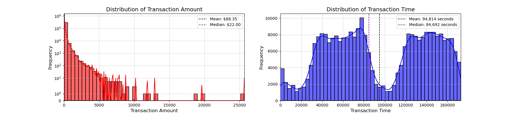

# Fraud Detection in Financial Transactions

## Main idea

Create predictive models to accurately detect whether a transaction is normal or fraudulent. The objectives include understanding the data distribution, creating a balanced sub-dataframe of fraud and non-fraud transactions, determining and evaluating various classifiers for accuracy, developing a neural network to compare its accuracy against the best classifier, and understanding common mistakes associated with imbalanced datasets.

### Challenges and its solutions

1. Imbalanced datasets are those where there is a severe skew in the class distribution, such as 1:100 or 1:1000 examples in the minority class to the majority class. This bias in the training dataset can influence many machine learning algorithms, leading some to ignore the minority class entirely. This is a problem as it is typically the minority class on which predictions are most important. One approach to addressing the problem of class imbalance is to randomly resample the training dataset. The two main approaches to randomly resampling an imbalanced dataset are to delete examples from the majority class, called **undersampling**, and to duplicate examples from the minority class, called **oversampling**. Both techniques can be used for two-class (binary) classification problems and multi-class classification problems with one or more majority or minority classes. Importantly, the change to the class distribution is only applied to the training dataset. The intent is to influence the fit of the models. The resampling is not applied to the test or holdout dataset used to evaluate the performance of a model. (See more in the repository of MIT+SCIKITLEARN:fundamentals).

### Dataset example

<table border="1" class="dataframe">
  <thead>
    <tr style="text-align: right;">
      <th></th>
      <th>Time</th>
      <th>V1</th>
      <th>V2</th>
      <th>V3</th>
      <th>V4</th>
      <th>V5</th>
      <th>V6</th>
      <th>V7</th>
      <th>V8</th>
      <th>V9</th>
      <th>...</th>
      <th>V21</th>
      <th>V22</th>
      <th>V23</th>
      <th>V24</th>
      <th>V25</th>
      <th>V26</th>
      <th>V27</th>
      <th>V28</th>
      <th>Amount</th>
      <th>Class</th>
    </tr>
  </thead>
  <tbody>
    <tr>
      <th>0</th>
      <td>0.0</td>
      <td>-1.359807</td>
      <td>-0.072781</td>
      <td>2.536347</td>
      <td>1.378155</td>
      <td>-0.338321</td>
      <td>0.462388</td>
      <td>0.239599</td>
      <td>0.098698</td>
      <td>0.363787</td>
      <td>...</td>
      <td>-0.018307</td>
      <td>0.277838</td>
      <td>-0.110474</td>
      <td>0.066928</td>
      <td>0.128539</td>
      <td>-0.189115</td>
      <td>0.133558</td>
      <td>-0.021053</td>
      <td>149.62</td>
      <td>0</td>
    </tr>
    <tr>
      <th>1</th>
      <td>0.0</td>
      <td>1.191857</td>
      <td>0.266151</td>
      <td>0.166480</td>
      <td>0.448154</td>
      <td>0.060018</td>
      <td>-0.082361</td>
      <td>-0.078803</td>
      <td>0.085102</td>
      <td>-0.255425</td>
      <td>...</td>
      <td>-0.225775</td>
      <td>-0.638672</td>
      <td>0.101288</td>
      <td>-0.339846</td>
      <td>0.167170</td>
      <td>0.125895</td>
      <td>-0.008983</td>
      <td>0.014724</td>
      <td>2.69</td>
      <td>0</td>
    </tr>
    <tr>
      <th>2</th>
      <td>1.0</td>
      <td>-1.358354</td>
      <td>-1.340163</td>
      <td>1.773209</td>
      <td>0.379780</td>
      <td>-0.503198</td>
      <td>1.800499</td>
      <td>0.791461</td>
      <td>0.247676</td>
      <td>-1.514654</td>
      <td>...</td>
      <td>0.247998</td>
      <td>0.771679</td>
      <td>0.909412</td>
      <td>-0.689281</td>
      <td>-0.327642</td>
      <td>-0.139097</td>
      <td>-0.055353</td>
      <td>-0.059752</td>
      <td>378.66</td>
      <td>0</td>
    </tr>
    <tr>
      <th>3</th>
      <td>1.0</td>
      <td>-0.966272</td>
      <td>-0.185226</td>
      <td>1.792993</td>
      <td>-0.863291</td>
      <td>-0.010309</td>
      <td>1.247203</td>
      <td>0.237609</td>
      <td>0.377436</td>
      <td>-1.387024</td>
      <td>...</td>
      <td>-0.108300</td>
      <td>0.005274</td>
      <td>-0.190321</td>
      <td>-1.175575</td>
      <td>0.647376</td>
      <td>-0.221929</td>
      <td>0.062723</td>
      <td>0.061458</td>
      <td>123.50</td>
      <td>0</td>
    </tr>
    <tr>
      <th>4</th>
      <td>2.0</td>
      <td>-1.158233</td>
      <td>0.877737</td>
      <td>1.548718</td>
      <td>0.403034</td>
      <td>-0.407193</td>
      <td>0.095921</td>
      <td>0.592941</td>
      <td>-0.270533</td>
      <td>0.817739</td>
      <td>...</td>
      <td>-0.009431</td>
      <td>0.798278</td>
      <td>-0.137458</td>
      <td>0.141267</td>
      <td>-0.206010</td>
      <td>0.502292</td>
      <td>0.219422</td>
      <td>0.215153</td>
      <td>69.99</td>
      <td>0</td>
    </tr>
  </tbody>
</table>

### Dataset information

- 284807 rows x 31 columns
- The mean of transaction amount is 88.34961925093133. But since it is an imbalanced data, using the average of all values is not the best information about, since it is sensitive to ouliers. Median is the best central tendency measure, giving a value of 22.
- No NaN Values in the dataframe.
- You can know if a transaction was a fraud because it has a class column: 0 means non-fraudulent (99.83 %) meanwhile 1 means fraudulent transaction (0.173 %).

## Some useful plots for business practices

1. **Transaction Time Distribution**
    This represents the time at which a transaction occurred. It might be   recorded in hours, minutes, and seconds since the start of a day or in    some other time format.

    Visualizing the distribution of transaction times can reveal patterns   such as:

    - Peak Transaction Hours: Times of day when transactions are most   frequent.
    - Quiet Periods: Times of day when transactions are less frequent.
    - Behavioral Patterns: If there are more transactions at specific times,    it might reflect user behavior or business practices.

    Example: If there are many transactions late at night, it might be worth checking    if this is typical behavior or indicative of potential fraud.

2. **Transaction Amount Distribution**

    This represents the density of transaction amounts in the dataset. It is represented by the currency value.

    Visualizing the distribution of transaction amount can reveal patterns   such as:
    - Identifies Common Amounts: Helps you see which transaction amounts are  most common.
    - Detects Anomalies: Reveals if there are unusual spikes or outliers in   transaction amounts.
    - Insights for Fraud Detection: For fraud detection, you might look for   patterns like very large or very small amounts compared to typical    transactions.
    Example: If most transactions are small but there are occasional very   large transactions, this could be suspicious behavior.

**Central tendency measures:**

| Measure | Definition                          | Sensitive to outliers |          Use When         |
|---------|-------------------------------------|-----------------------|:-------------------------:|
| Mean    | Average of all values.              | Yes                   | Symmetrical Distributions |
| Median  | Middle value when data is sorted.   | No                    | Skewed Distributions      |
| Mode    | Most frequent value in the dataset. | No                    | For Categorical Data      |

### Splitting data

Before applying any under-sampling techniques, it’s crucial to separate the original dataframe. Although we will split the data during the implementation of Random Under-Sampling or Over-Sampling techniques, it is important to remember that we should test our models on the original testing set, not on the subset created by these techniques. The primary objective is to fit the model using the modified dataframes (that have been under-sampled or over-sampled) to help the model detect patterns, and then evaluate its performance on the untouched, original testing set.

